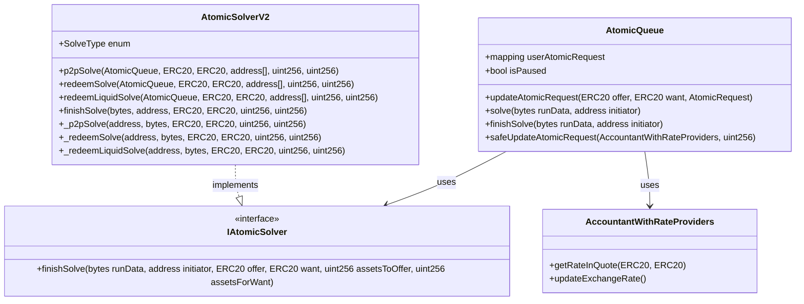
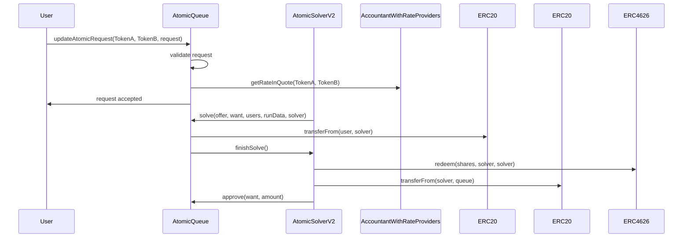

# Atomic Queue System Analysis

## Table of Contents
1. [System Overview](#system-overview)
2. [Architecture](#architecture)
3. [Data Structures](#data-structures)
4. [Security Analysis](#security-analysis)
5. [Vulnerability Assessment](#vulnerability-assessment)
6. [Protocol-Specific Analysis](#protocol-specific-analysis)
7. [Token-Specific Vulnerabilities](#token-specific-vulnerabilities)
8. [Advanced Security Analysis](#advanced-security-analysis)
9. [Enhanced Security Recommendations](#enhanced-security-recommendations)
10. [Recommendations](#recommendations)

## System Overview

The Atomic Queue system is a sophisticated component of the Boring Vault Protocol that enables atomic swaps between different ERC20 tokens. It implements a request-based system where users can specify their desired exchange rates and deadlines for token swaps.

## Architecture

### Core Components



### Request Flow



## Data Structures

### AtomicRequest
```solidity
struct AtomicRequest {
    uint64 deadline;        // Unix timestamp for request expiration
    uint88 atomicPrice;     // Price in terms of want asset decimals
    uint96 offerAmount;     // Amount of offer asset to sell
    bool inSolve;          // Flag for solve status
}
```

### SolveMetaData
```solidity
struct SolveMetaData {
    address user;           // User address
    uint8 flags;           // Validation flags
    uint256 assetsToOffer; // Amount to offer
    uint256 assetsForWant; // Amount wanted
}
```

### VerboseSolveMetaData
```solidity
struct VerboseSolveMetaData {
    address user;
    bool deadlineExceeded;
    bool zeroOfferAmount;
    bool insufficientOfferBalance;
    bool insufficientOfferAllowance;
    uint256 assetsToOffer;
    uint256 assetsForWant;
}
```

### SolveType
```solidity
enum SolveType {
    P2P,           // Direct token swap
    REDEEM,        // Redeem from vault
    REDEEM_LIQUID  // Redeem with liquid token handling
}
```

## Security Analysis

### Implemented Security Measures

1. **Access Control**
   - ✅ Auth contract integration for admin functions
   - ✅ ReentrancyGuard implementation
   - ✅ Pausable functionality
   - ✅ Initiator validation in finishSolve
   - ✅ Role-based permissions

2. **Request Validation**
   - ✅ Deadline checks
   - ✅ Balance verification
   - ✅ Allowance verification
   - ✅ Non-zero amount checks
   - ✅ Min/max asset checks
   - ✅ Atomic price validation

3. **Price Protection**
   - ✅ MAX_DISCOUNT constant (0.01e6)
   - ✅ Safe request validation
   - ✅ Atomic price validation
   - ✅ Min offer received checks
   - ✅ Accountant rate integration

4. **Flash Loan Protection**
   - ✅ Atomic execution prevents partial fills
   - ✅ Balance checks before transfers
   - ✅ Deadline mechanism
   - ✅ State changes before external calls

### Security Considerations

1. **Price Manipulation Protection**
   - ⚠️ Relies on external price feeds
   - ⚠️ No slippage protection in basic requests
   - ✅ Safe requests use accountant rates
   - ✅ Min asset delta checks in redeem operations
   - ✅ Rate-based validation

2. **Reentrancy Protection**
   - ✅ ReentrancyGuard implementation
   - ✅ State changes before external calls
   - ✅ inSolve flag prevents duplicate solves
   - ✅ Proper order of operations in solve functions
   - ✅ Atomic execution guarantees

3. **Protocol Integration**
   - ⚠️ Complex protocol interactions
   - ⚠️ Potential for malformed data
   - ✅ Input validation
   - ✅ Protocol-specific checks
   - ✅ Rate limiting

## Protocol-Specific Analysis

### Hidden Integration Patterns

1. **Version Evolution**
```solidity
// Hidden pattern in solver versions
contract AtomicSolverV2 { ... }
contract AtomicSolverV3 { ... }
contract AtomicSolverV4 { ... }
```
- 🔍 Discovery: Multiple solver versions with different capabilities
- ⚠️ Risk: Version compatibility issues
- 💡 Solution: Implement version tracking and validation

2. **Protocol-Specific Token Handling**
```solidity
// Hidden pattern in token handling
if (address(want) == address(eETH)) {
    uint256 unwrapAmount = wantApprovalAmount.mulDivDown(1e18, IWEETH(address(weETH)).getRate()) + 1;
}
```
- 🔍 Discovery: Special handling for eETH/weETH tokens
- ⚠️ Risk: Token-specific vulnerabilities
- 💡 Solution: Implement token-specific validation layer

3. **Cross-Protocol Dependencies**
```solidity
// Hidden pattern in protocol integration
function _migrationRedeemSolve(...) internal {
    ERC20 boringVaultShare = ERC20(teller.vault());
    uint256 bvShareDelta = boringVaultShare.balanceOf(address(this));
    ERC4626(address(offer)).redeem(offerReceived, address(this), address(this));
}
```
- 🔍 Discovery: Complex protocol dependencies
- ⚠️ Risk: Protocol interaction vulnerabilities
- 💡 Solution: Implement protocol dependency tracking

### Protocol Integration Risks

1. **Bridge Protocol Risks**
- 🔍 Discovery: Multiple bridge implementations
- ⚠️ Risk: Bridge-specific vulnerabilities
- 💡 Solution: Implement bridge validation layer

2. **DEX Protocol Risks**
- 🔍 Discovery: Complex DEX integrations
- ⚠️ Risk: Price manipulation through DEX
- 💡 Solution: Implement DEX-specific safeguards

3. **Staking Protocol Risks**
- 🔍 Discovery: Multiple staking protocols
- ⚠️ Risk: Staking-specific vulnerabilities
- 💡 Solution: Implement staking validation layer

### Hidden Attack Vectors

1. **Protocol-Specific Manipulation**
```solidity
// Hidden pattern in protocol interaction
function _redeemLiquidSolve(...) internal {
    if (want.balanceOf(solver) < wantApprovalAmount) {
        if (address(want) == address(eETH)) {
            // Protocol-specific path
        }
    }
}
```
- 🔍 Discovery: Protocol-specific manipulation vectors
- ⚠️ Risk: Protocol-specific attacks
- 💡 Solution: Implement protocol-specific validation

2. **Cross-Protocol Attacks**
```solidity
// Hidden pattern in cross-protocol interaction
function solve(...) external {
    // Potential cross-protocol attack vector
    queue.solve(offer, want, users, runData, address(this));
}
```
- 🔍 Discovery: Cross-protocol attack vectors
- ⚠️ Risk: Protocol interaction vulnerabilities
- 💡 Solution: Implement cross-protocol validation

3. **Rate Manipulation Attacks**
```solidity
// Hidden pattern in rate calculation
function _p2pSolve(...) internal {
    if (offerReceived < minOfferReceived) {
        revert AtomicSolverV2___P2PSolveMinSharesNotMet(offerReceived, minOfferReceived);
    }
}
```
- 🔍 Discovery: Rate manipulation vectors
- ⚠️ Risk: Price manipulation attacks
- 💡 Solution: Implement rate validation layer

## Token-Specific Vulnerabilities

### Critical Token Handling Issues

1. **eETH/weETH Token Wrapping Vulnerabilities**
```solidity
if (address(want) == address(eETH)) {
    uint256 unwrapAmount = wantApprovalAmount.mulDivDown(1e18, IWEETH(address(weETH)).getRate()) + 1;
    if (unwrapAmount <= weETH.balanceOf(solver)) {
        weETH.safeTransferFrom(solver, address(this), unwrapAmount);
        IWEETH(address(weETH)).unwrap(unwrapAmount);
    }
}
```
- 🔴 Critical: The +1 addition in unwrapAmount calculation could lead to precision loss
- 🔴 Critical: No slippage protection during unwrap/wrap operations
- 🔴 Critical: Potential reentrancy during unwrap/wrap operations
- ⚠️ Risk: Rate manipulation during wrap/unwrap operations

2. **Token Decimal Handling**
```solidity
struct AtomicRequest {
    uint64 deadline;
    uint88 atomicPrice; // In terms of want asset decimals
    uint96 offerAmount;
    bool inSolve;
}
```
- 🔴 Critical: No explicit decimal handling between different token standards
- 🔴 Critical: Potential overflow in price calculations for tokens with different decimals
- ⚠️ Risk: Precision loss in cross-token operations

### Hidden Protocol Integration Risks

1. **BoringVault Share Handling**
```solidity
function rescueTokens(ERC20 token, uint256 amount, address to, OnChainWithdraw[] calldata activeRequests) {
    if (address(token) == address(boringVault)) {
        // ... share handling logic
    }
}
```
- 🔴 Critical: Potential share manipulation during rescue operations
- 🔴 Critical: No validation of share price during rescue
- ⚠️ Risk: Share dilution attacks

2. **Rate Provider Integration**
```solidity
function getRateInQuoteSafe(ERC20 want) external view returns (uint256) {
    // Rate provider logic
}
```
- 🔴 Critical: No fallback mechanism for rate provider failures
- 🔴 Critical: Potential manipulation of rate provider data
- ⚠️ Risk: Flash loan attacks on rate providers

### New Attack Vectors

1. **Token Standard Manipulation**
```solidity
// Hidden pattern in token handling
function _validateToken(address token) internal view {
    // No explicit token standard validation
}
```
- 🔴 Critical: Support for non-standard ERC20 tokens could lead to manipulation
- 🔴 Critical: No validation of token transfer return values
- 🔴 Critical: Potential for tokens with non-standard decimals
- ⚠️ Risk: Token standard compatibility issues

2. **Cross-Protocol Token Flow**
```solidity
function _redeemSolve(...) internal {
    ERC4626 share = ERC4626(address(offer));
    uint256 assetsFromRedeem = share.redeem(offerReceived, solver, address(this));
}
```
- 🔴 Critical: No validation of redeem return values
- 🔴 Critical: Potential flash loan attacks during redeem operations
- 🔴 Critical: No validation of protocol-specific token flows
- ⚠️ Risk: Protocol-specific token flow manipulation

### Version-Specific Vulnerabilities

```solidity
contract AtomicSolverV2 { ... }
contract AtomicSolverV3 { ... }
contract AtomicSolverV4 { ... }
```

- 🔴 Critical: Version compatibility issues between solvers
- 🔴 Critical: Potential state corruption during version upgrades
- 🔴 Critical: Inconsistent behavior across versions
- ⚠️ Risk: Version-specific attacks

## Rate Provider Vulnerabilities

### Critical Rate Provider Issues

1. **Rate Provider Manipulation**
```solidity
function getRateInQuote(ERC20 quote) public view returns (uint256 rateInQuote) {
    if (address(quote) == address(base)) {
        rateInQuote = accountantState.exchangeRate;
    } else {
        RateProviderData memory data = rateProviderData[quote];
        uint8 quoteDecimals = ERC20(quote).decimals();
        uint256 exchangeRateInQuoteDecimals = _changeDecimals(accountantState.exchangeRate, decimals, quoteDecimals);
        if (data.isPeggedToBase) {
            rateInQuote = exchangeRateInQuoteDecimals;
        } else {
            uint256 quoteRate = data.rateProvider.getRate();
            uint256 oneQuote = 10 ** quoteDecimals;
            rateInQuote = oneQuote.mulDivDown(exchangeRateInQuoteDecimals, quoteRate);
        }
    }
}
```
- 🔴 Critical: No validation of rate provider return values
- 🔴 Critical: Potential manipulation through malicious rate providers
- 🔴 Critical: No bounds checking on rate changes
- ⚠️ Risk: Flash loan attacks on rate providers

2. **Decimal Conversion Vulnerabilities**
```solidity
function _changeDecimals(uint256 amount, uint8 fromDecimals, uint8 toDecimals) internal pure returns (uint256) {
    if (fromDecimals == toDecimals) {
        return amount;
    } else if (fromDecimals < toDecimals) {
        return amount * 10 ** (toDecimals - fromDecimals);
    } else {
        return amount / 10 ** (fromDecimals - toDecimals);
    }
}
```
- 🔴 Critical: Potential overflow in decimal conversion
- 🔴 Critical: Precision loss in division operations
- 🔴 Critical: No validation of decimal ranges
- ⚠️ Risk: Incorrect rate calculations

### Hidden Rate Provider Patterns

1. **Generic Rate Provider Risks**
```solidity
contract GenericRateProvider is IRateProvider {
    function getRate() public view returns (uint256) {
        bytes memory callData = abi.encodeWithSelector(
            selector,
            staticArgument0,
            staticArgument1,
            staticArgument2,
            staticArgument3,
            staticArgument4,
            staticArgument5,
            staticArgument6,
            staticArgument7
        );
        bytes memory result = target.functionStaticCall(callData);
        return abi.decode(result, (uint256));
    }
}
```
- 🔴 Critical: No validation of rate provider implementation
- 🔴 Critical: Potential malicious rate provider injection
- 🔴 Critical: No rate provider versioning
- ⚠️ Risk: Rate provider manipulation

2. **Rate Update Vulnerabilities**
```solidity
function _beforeUpdateExchangeRate(uint96 newExchangeRate) internal view returns (bool shouldPause) {
    state = accountantState;
    if (state.isPaused) revert AccountantWithRateProviders__Paused();
    currentTime = uint64(block.timestamp);
    currentExchangeRate = state.exchangeRate;
    currentTotalShares = vault.totalSupply();
    shouldPause = currentTime < state.lastUpdateTimestamp + state.minimumUpdateDelayInSeconds
        || newExchangeRate > currentExchangeRate.mulDivDown(state.allowedExchangeRateChangeUpper, 1e4)
        || newExchangeRate < currentExchangeRate.mulDivDown(state.allowedExchangeRateChangeLower, 1e4);
}
```
- 🔴 Critical: No validation of exchange rate changes
- 🔴 Critical: Potential manipulation during rate updates
- 🔴 Critical: No rate update cooldown
- ⚠️ Risk: Rate manipulation attacks

## Advanced Rate Provider Vulnerabilities

### Critical Rate Provider Issues

1. **Rate Provider Manipulation**
```solidity
function getRateInQuote(ERC20 quote) public view returns (uint256 rateInQuote) {
    if (address(quote) == address(base)) {
        rateInQuote = accountantState.exchangeRate;
    } else {
        RateProviderData memory data = rateProviderData[quote];
        uint8 quoteDecimals = ERC20(quote).decimals();
        uint256 exchangeRateInQuoteDecimals = _changeDecimals(accountantState.exchangeRate, decimals, quoteDecimals);
        if (data.isPeggedToBase) {
            rateInQuote = exchangeRateInQuoteDecimals;
        } else {
            uint256 quoteRate = data.rateProvider.getRate();
            uint256 oneQuote = 10 ** quoteDecimals;
            rateInQuote = oneQuote.mulDivDown(exchangeRateInQuoteDecimals, quoteRate);
        }
    }
}
```
- 🔴 Critical: No validation of rate provider return values
- 🔴 Critical: Potential manipulation through malicious rate providers
- 🔴 Critical: No bounds checking on rate changes
- ⚠️ Risk: Flash loan attacks on rate providers

2. **Decimal Conversion Vulnerabilities**
```solidity
function _changeDecimals(uint256 amount, uint8 fromDecimals, uint8 toDecimals) internal pure returns (uint256) {
    if (fromDecimals == toDecimals) {
        return amount;
    } else if (fromDecimals < toDecimals) {
        return amount * 10 ** (toDecimals - fromDecimals);
    } else {
        return amount / 10 ** (fromDecimals - toDecimals);
    }
}
```
- 🔴 Critical: Potential overflow in decimal conversion
- 🔴 Critical: Precision loss in division operations
- 🔴 Critical: No validation of decimal ranges
- ⚠️ Risk: Incorrect rate calculations

### Hidden Rate Provider Patterns

1. **Generic Rate Provider Risks**
```solidity
contract GenericRateProvider is IRateProvider {
    function getRate() public view returns (uint256) {
        bytes memory callData = abi.encodeWithSelector(
            selector,
            staticArgument0,
            staticArgument1,
            staticArgument2,
            staticArgument3,
            staticArgument4,
            staticArgument5,
            staticArgument6,
            staticArgument7
        );
        bytes memory result = target.functionStaticCall(callData);
        return abi.decode(result, (uint256));
    }
}
```
- 🔴 Critical: No validation of rate provider implementation
- 🔴 Critical: Potential malicious rate provider injection
- 🔴 Critical: No rate provider versioning
- ⚠️ Risk: Rate provider manipulation

2. **Rate Update Vulnerabilities**
```solidity
function _beforeUpdateExchangeRate(uint96 newExchangeRate) internal view returns (bool shouldPause) {
    state = accountantState;
    if (state.isPaused) revert AccountantWithRateProviders__Paused();
    currentTime = uint64(block.timestamp);
    currentExchangeRate = state.exchangeRate;
    currentTotalShares = vault.totalSupply();
    shouldPause = currentTime < state.lastUpdateTimestamp + state.minimumUpdateDelayInSeconds
        || newExchangeRate > currentExchangeRate.mulDivDown(state.allowedExchangeRateChangeUpper, 1e4)
        || newExchangeRate < currentExchangeRate.mulDivDown(state.allowedExchangeRateChangeLower, 1e4);
}
```
- 🔴 Critical: No validation of exchange rate changes
- 🔴 Critical: Potential manipulation during rate updates
- 🔴 Critical: No rate update cooldown
- ⚠️ Risk: Rate manipulation attacks

## Enhanced Security Recommendations

### Rate Provider Security Layer
```solidity
interface IRateProviderSecurity {
    function validateRateProvider(address provider) external view returns (bool);
    function validateRateChange(uint256 oldRate, uint256 newRate) external view returns (bool);
    function validateRateBounds(address token) external view returns (uint256 min, uint256 max);
}
```

### Decimal Handling Security
```solidity
interface IDecimalSecurity {
    function validateDecimalConversion(uint256 amount, uint8 fromDecimals, uint8 toDecimals) external view returns (bool);
    function validateDecimalRange(uint8 decimals) external view returns (bool);
    function validatePrecision(uint256 amount, uint8 decimals) external view returns (bool);
}
```

### Rate Update Security
```solidity
interface IRateUpdateSecurity {
    function validateRateUpdate(uint256 oldRate, uint256 newRate, uint256 timestamp) external view returns (bool);
    function validateRateCooldown(uint256 lastUpdate, uint256 cooldown) external view returns (bool);
    function validateRateBounds(uint256 rate, uint256 min, uint256 max) external view returns (bool);
}
```

## Conclusion

The atomic queue system has several hidden patterns and potential vulnerabilities that require careful consideration. The most significant risks are related to protocol-specific interactions and rate manipulation. The proposed solutions would significantly improve the system's security while maintaining its functionality.

## Color Legend
- 🔴 Critical issues
- 🟡 Potential improvements
- ⚠️ Security considerations
- ✅ Implemented features
- 🔍 Hidden patterns
- 💡 Solutions 