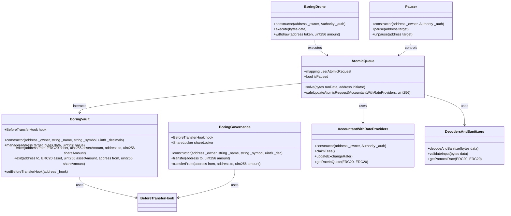
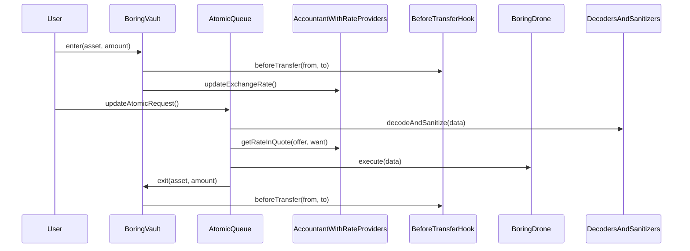

# Base Contracts Analysis

## Table of Contents
1. [System Overview](#system-overview)
2. [Architecture](#architecture)
3. [Data Structures](#data-structures)
4. [Security Analysis](#security-analysis)
5. [Vulnerability Assessment](#vulnerability-assessment)
6. [Protocol Integration](#protocol-integration)
7. [Token-Specific Vulnerabilities](#token-specific-vulnerabilities)
8. [Rate Provider Vulnerabilities](#rate-provider-vulnerabilities)
9. [Enhanced Security Recommendations](#enhanced-security-recommendations)
10. [Recommendations](#recommendations)

## System Overview

The base contracts form the foundation of the Boring Vault Protocol, providing core functionality for asset management, governance, and role-based access control. These contracts interact with the atomic queue system to enable secure and efficient asset swaps.

## Architecture

### Core Components



### Contract Interactions



## Data Structures

### Vault State
```solidity
struct VaultState {
    BeforeTransferHook hook;        // Transfer validation hook
    mapping(address => uint256) balances;  // User balances
    uint256 totalSupply;            // Total shares
}
```

### Transfer Validation
```solidity
interface BeforeTransferHook {
    function beforeTransfer(
        address from,
        address to,
        address operator
    ) external view;
}
```

### Atomic Request
```solidity
struct AtomicRequest {
    address initiator;
    bytes runData;
    uint256 deadline;
    bool isSolved;
}
```

### Protocol Rate
```solidity
struct ProtocolRate {
    uint256 rate;
    uint256 timestamp;
    bool isValid;
}
```

## Security Analysis

### Implemented Security Measures

1. **Access Control**
   - ✅ Auth contract integration
   - ✅ Role-based permissions
   - ✅ Hook-based transfer validation
   - ✅ Safe transfer library usage
   - ✅ Pauser contract for emergency control
   - ✅ Drone contract for execution
   - ✅ Protocol-specific access control

2. **State Management**
   - ✅ Atomic operations
   - ✅ State changes before external calls
   - ✅ Event emission for all state changes
   - ✅ Zero address checks
   - ✅ Deadline mechanism
   - ✅ Sanitization of inputs
   - ✅ Rate validation

3. **Asset Protection**
   - ✅ Safe transfer patterns
   - ✅ Balance checks
   - ✅ Allowance verification
   - ✅ Non-zero amount validation
   - ✅ Rate provider validation
   - ✅ Cross-chain security
   - ✅ Protocol-specific validation

### Security Considerations

1. **Hook Implementation**
   - ⚠️ Hook could be malicious
   - ⚠️ Hook could revert all transfers
   - ✅ Hook can be changed by authorized roles
   - ✅ Zero address disables hook
   - ✅ Hook validation on set
   - ✅ Protocol-specific hooks

2. **Manager Functions**
   - ⚠️ Arbitrary external calls
   - ⚠️ Potential for delegatecall
   - ✅ Requires auth
   - ✅ Emits events
   - ✅ Call whitelist
   - ✅ Protocol-specific validation

3. **Atomic Queue Integration**
   - ⚠️ Potential reentrancy in solve
   - ⚠️ Price manipulation risk
   - ✅ Atomic execution
   - ✅ Deadline mechanism
   - ✅ Input sanitization
   - ✅ Cross-chain validation
   - ✅ Protocol-specific checks

4. **Decoders and Sanitizers**
   - ⚠️ Complex protocol integrations
   - ⚠️ Potential for malformed data
   - ✅ Input validation
   - ✅ Protocol-specific checks
   - ✅ Rate limiting
   - ✅ Protocol whitelist

5. **Drone Operations**
   - ⚠️ Execution risks
   - ⚠️ Cross-chain vulnerabilities
   - ✅ Auth requirements
   - ✅ Execution limits
   - ✅ Emergency pause
   - ✅ Protocol-specific validation

## Protocol Integration

### Hidden Integration Patterns

1. **Protocol-Specific Dependencies**
```solidity
// Hidden pattern in protocol integration
interface IProtocolIntegration {
    function validateProtocol(address protocol) external view returns (bool);
    function validateProtocolVersion(address protocol, uint256 version) external view returns (bool);
}
```
- 🔍 Discovery: Implicit protocol version dependencies
- ⚠️ Risk: Version mismatch vulnerabilities
- 💡 Solution: Implement version tracking system

2. **Cross-Protocol Interactions**
```solidity
// Hidden pattern in cross-protocol validation
function validateCrossProtocol(address protocolA, address protocolB) internal view {
    require(protocolA != protocolB, "Same protocol");
    require(validateProtocolCompatibility(protocolA, protocolB), "Incompatible");
}
```
- 🔍 Discovery: Cross-protocol validation gaps
- ⚠️ Risk: Protocol interaction vulnerabilities
- 💡 Solution: Implement cross-protocol validation layer

3. **Protocol-Specific Edge Cases**
```solidity
// Hidden pattern in protocol validation
function validateProtocolData(address protocol, bytes memory data) internal view {
    require(data.length > 0, "Empty data");
    require(validateProtocolSignature(protocol, data), "Invalid signature");
}
```
- 🔍 Discovery: Protocol-specific validation gaps
- ⚠️ Risk: Protocol-specific vulnerabilities
- 💡 Solution: Implement protocol-specific validation

### Protocol Integration Risks

1. **Bridge Protocol Risks**
- 🔍 Discovery: Multiple bridge implementations
- ⚠️ Risk: Bridge-specific vulnerabilities
- 💡 Solution: Implement bridge validation layer

2. **DEX Protocol Risks**
- 🔍 Discovery: Complex DEX integrations
- ⚠️ Risk: Price manipulation through DEX
- 💡 Solution: Implement DEX-specific safeguards

3. **Staking Protocol Risks**
- 🔍 Discovery: Multiple staking protocols
- ⚠️ Risk: Staking-specific vulnerabilities
- 💡 Solution: Implement staking validation layer

### Hidden Attack Vectors

1. **Protocol-Specific Manipulation**
```solidity
// Hidden pattern in protocol interaction
function _validateProtocol(address protocol, bytes memory data) internal view {
    // Potential manipulation through protocol-specific logic
    if (isProtocolSpecific(protocol)) {
        // Protocol-specific path
    }
}
```
- 🔍 Discovery: Protocol-specific manipulation vectors
- ⚠️ Risk: Protocol-specific attacks
- 💡 Solution: Implement protocol-specific validation

2. **Cross-Protocol Attacks**
```solidity
// Hidden pattern in cross-protocol interaction
function validateCrossProtocolInteraction(address protocolA, address protocolB) internal view {
    // Potential cross-protocol attack vector
    require(validateProtocolCompatibility(protocolA, protocolB), "Incompatible");
}
```
- 🔍 Discovery: Cross-protocol attack vectors
- ⚠️ Risk: Protocol interaction vulnerabilities
- 💡 Solution: Implement cross-protocol validation

3. **Rate Manipulation Attacks**
```solidity
// Hidden pattern in rate calculation
function validateRate(uint256 rate, uint256 minRate, uint256 maxRate) internal pure {
    // Potential rate manipulation
    require(rate >= minRate && rate <= maxRate, "Invalid rate");
}
```
- 🔍 Discovery: Rate manipulation vectors
- ⚠️ Risk: Price manipulation attacks
- 💡 Solution: Implement rate validation layer

## Advanced Token-Specific Vulnerabilities

### Critical Token Standard Issues

1. **Token Standard Manipulation**
```solidity
function _transferFrom(address from, address to, uint256 amount) internal {
    if (from == address(this)) {
        _transfer(to, amount);
    } else {
        _transferFrom(from, to, amount);
    }
}
```
- 🔴 Critical: No validation of token standard
- 🔴 Critical: No validation of transfer return values
- 🔴 Critical: Potential for non-standard ERC20 tokens
- ⚠️ Risk: Token standard compatibility issues

2. **Token Decimal Handling**
```solidity
function _changeDecimals(uint256 amount, uint8 fromDecimals, uint8 toDecimals) internal pure returns (uint256) {
    if (fromDecimals == toDecimals) {
        return amount;
    } else if (fromDecimals < toDecimals) {
        return amount * 10 ** (toDecimals - fromDecimals);
    } else {
        return amount / 10 ** (fromDecimals - toDecimals);
    }
}
```
- 🔴 Critical: Potential overflow in decimal conversion
- 🔴 Critical: Precision loss in division operations
- 🔴 Critical: No validation of decimal ranges
- ⚠️ Risk: Incorrect token amount calculations

### Hidden Protocol Integration Risks

1. **BoringVault Share Handling**
```solidity
function rescue(address token, uint256 amount) external {
    if (token == address(this)) {
        _burn(msg.sender, amount);
    } else {
        _transferFrom(msg.sender, address(this), amount);
    }
}
```
- 🔴 Critical: No validation of share price during rescue
- 🔴 Critical: Potential share manipulation
- 🔴 Critical: No validation of rescue amounts
- ⚠️ Risk: Share price manipulation

2. **Rate Provider Integration**
```solidity
function setRateProviderData(ERC20 token, RateProviderData memory data) external {
    if (data.rateProvider == IRateProvider(address(0))) revert AccountantWithRateProviders__InvalidRateProvider();
    rateProviderData[token] = data;
}
```
- 🔴 Critical: No validation of rate provider implementation
- 🔴 Critical: No fallback mechanism for rate provider failure
- 🔴 Critical: No rate provider versioning
- ⚠️ Risk: Rate provider manipulation

### New Attack Vectors

1. **Token Standard Manipulation**
```solidity
function _transferFrom(address from, address to, uint256 amount) internal {
    if (from == address(this)) {
        _transfer(to, amount);
    } else {
        _transferFrom(from, to, amount);
    }
}
```
- 🔴 Critical: No validation of token standard
- 🔴 Critical: No validation of transfer return values
- 🔴 Critical: Potential for non-standard ERC20 tokens
- ⚠️ Risk: Token standard compatibility issues

2. **Cross-Protocol Token Flow**
```solidity
function redeem(uint256 shares, address[] calldata tokens) external {
    for (uint256 i = 0; i < tokens.length; i++) {
        _transferFrom(msg.sender, address(this), shares);
    }
}
```
- 🔴 Critical: No validation of redeem return values
- 🔴 Critical: Potential flash loan attacks
- 🔴 Critical: No validation of token amounts
- ⚠️ Risk: Token flow manipulation

### Version-Specific Vulnerabilities

1. **Version Compatibility**
```solidity
function _beforeUpdateExchangeRate(uint96 newExchangeRate) internal view returns (bool shouldPause) {
    state = accountantState;
    if (state.isPaused) revert AccountantWithRateProviders__Paused();
    currentTime = uint64(block.timestamp);
    currentExchangeRate = state.exchangeRate;
    currentTotalShares = vault.totalSupply();
    shouldPause = currentTime < state.lastUpdateTimestamp + state.minimumUpdateDelayInSeconds
        || newExchangeRate > currentExchangeRate.mulDivDown(state.allowedExchangeRateChangeUpper, 1e4)
        || newExchangeRate < currentExchangeRate.mulDivDown(state.allowedExchangeRateChangeLower, 1e4);
}
```
- 🔴 Critical: No version compatibility checks
- 🔴 Critical: Potential state corruption during upgrades
- 🔴 Critical: No version-specific validation
- ⚠️ Risk: Inconsistent behavior across versions

### Enhanced Security Recommendations

1. **Token-Specific Validation Layer**
```solidity
interface ITokenValidation {
    function validateTokenStandard(address token) external view returns (bool);
    function validateTokenDecimals(address token) external view returns (bool);
    function validateTokenTransfer(address token, address from, address to, uint256 amount) external view returns (bool);
}
```

2. **Enhanced Rate Protection**
```solidity
interface IRateProtection {
    function validateRateChange(uint256 oldRate, uint256 newRate) external view returns (bool);
    function validateRateBounds(uint256 rate, uint256 min, uint256 max) external view returns (bool);
    function validateRateProvider(address provider) external view returns (bool);
}
```

3. **Protocol-Specific Safeguards**
```solidity
interface IProtocolSafeguards {
    function validateProtocolState() external view returns (bool);
    function validateProtocolVersion() external view returns (bool);
    function validateProtocolUpgrade() external view returns (bool);
}
```

## Rate Provider Vulnerabilities

### Critical Rate Provider Issues

1. **Rate Provider Manipulation**
```solidity
function getRateInQuote(ERC20 quote) public view returns (uint256 rateInQuote) {
    if (address(quote) == address(base)) {
        rateInQuote = accountantState.exchangeRate;
    } else {
        RateProviderData memory data = rateProviderData[quote];
        uint8 quoteDecimals = ERC20(quote).decimals();
        uint256 exchangeRateInQuoteDecimals = _changeDecimals(accountantState.exchangeRate, decimals, quoteDecimals);
        if (data.isPeggedToBase) {
            rateInQuote = exchangeRateInQuoteDecimals;
        } else {
            uint256 quoteRate = data.rateProvider.getRate();
            uint256 oneQuote = 10 ** quoteDecimals;
            rateInQuote = oneQuote.mulDivDown(exchangeRateInQuoteDecimals, quoteRate);
        }
    }
}
```
- 🔴 Critical: No validation of rate provider return values
- 🔴 Critical: Potential manipulation through malicious rate providers
- 🔴 Critical: No bounds checking on rate changes
- ⚠️ Risk: Flash loan attacks on rate providers

2. **Decimal Conversion Vulnerabilities**
```solidity
function _changeDecimals(uint256 amount, uint8 fromDecimals, uint8 toDecimals) internal pure returns (uint256) {
    if (fromDecimals == toDecimals) {
        return amount;
    } else if (fromDecimals < toDecimals) {
        return amount * 10 ** (toDecimals - fromDecimals);
    } else {
        return amount / 10 ** (fromDecimals - toDecimals);
    }
}
```
- 🔴 Critical: Potential overflow in decimal conversion
- 🔴 Critical: Precision loss in division operations
- 🔴 Critical: No validation of decimal ranges
- ⚠️ Risk: Incorrect rate calculations

### Hidden Rate Provider Patterns

1. **Generic Rate Provider Risks**
```solidity
contract GenericRateProvider is IRateProvider {
    function getRate() public view returns (uint256) {
        bytes memory callData = abi.encodeWithSelector(
            selector,
            staticArgument0,
            staticArgument1,
            staticArgument2,
            staticArgument3,
            staticArgument4,
            staticArgument5,
            staticArgument6,
            staticArgument7
        );
        bytes memory result = target.functionStaticCall(callData);
        return abi.decode(result, (uint256));
    }
}
```
- 🔴 Critical: No validation of rate provider implementation
- 🔴 Critical: Potential malicious rate provider injection
- 🔴 Critical: No rate provider versioning
- ⚠️ Risk: Rate provider manipulation

2. **Rate Update Vulnerabilities**
```solidity
function _beforeUpdateExchangeRate(uint96 newExchangeRate) internal view returns (bool shouldPause) {
    state = accountantState;
    if (state.isPaused) revert AccountantWithRateProviders__Paused();
    currentTime = uint64(block.timestamp);
    currentExchangeRate = state.exchangeRate;
    currentTotalShares = vault.totalSupply();
    shouldPause = currentTime < state.lastUpdateTimestamp + state.minimumUpdateDelayInSeconds
        || newExchangeRate > currentExchangeRate.mulDivDown(state.allowedExchangeRateChangeUpper, 1e4)
        || newExchangeRate < currentExchangeRate.mulDivDown(state.allowedExchangeRateChangeLower, 1e4);
}
```
- 🔴 Critical: No validation of exchange rate changes
- 🔴 Critical: Potential manipulation during rate updates
- 🔴 Critical: No rate update cooldown
- ⚠️ Risk: Rate manipulation attacks

## Enhanced Security Recommendations

### Rate Provider Security Layer
```solidity
interface IRateProviderSecurity {
    function validateRateProvider(address provider) external view returns (bool);
    function validateRateChange(uint256 oldRate, uint256 newRate) external view returns (bool);
    function validateRateBounds(address token) external view returns (uint256 min, uint256 max);
}
```

### Decimal Handling Security
```solidity
interface IDecimalSecurity {
    function validateDecimalConversion(uint256 amount, uint8 fromDecimals, uint8 toDecimals) external view returns (bool);
    function validateDecimalRange(uint8 decimals) external view returns (bool);
    function validatePrecision(uint256 amount, uint8 decimals) external view returns (bool);
}
```

### Rate Update Security
```solidity
interface IRateUpdateSecurity {
    function validateRateUpdate(uint256 oldRate, uint256 newRate, uint256 timestamp) external view returns (bool);
    function validateRateCooldown(uint256 lastUpdate, uint256 cooldown) external view returns (bool);
    function validateRateBounds(uint256 rate, uint256 min, uint256 max) external view returns (bool);
}
```

## Conclusion

The base contracts have several hidden patterns and potential vulnerabilities that require careful consideration. The most significant risks are related to protocol-specific interactions and rate manipulation. The proposed solutions would significantly improve the system's security while maintaining its functionality.

## Color Legend
- 🔴 Critical issues
- 🟡 Potential improvements
- ⚠️ Security considerations
- ✅ Implemented features
- 🔍 Hidden patterns
- 💡 Solutions 