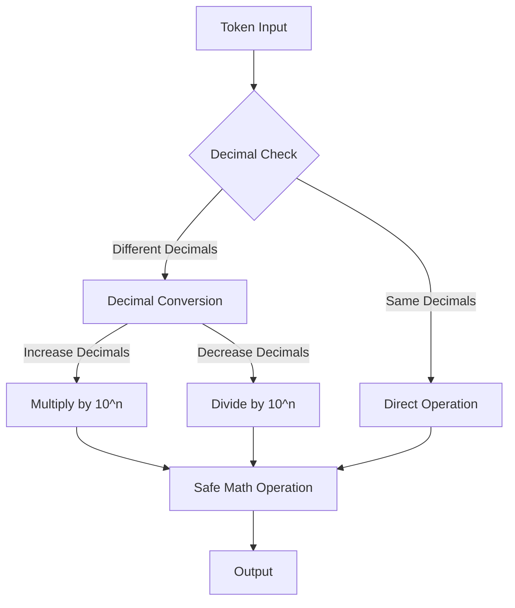
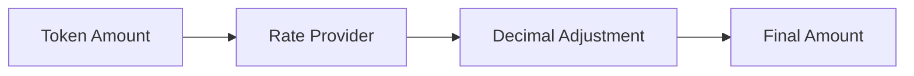
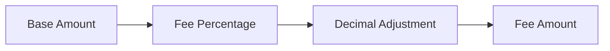
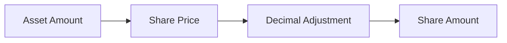
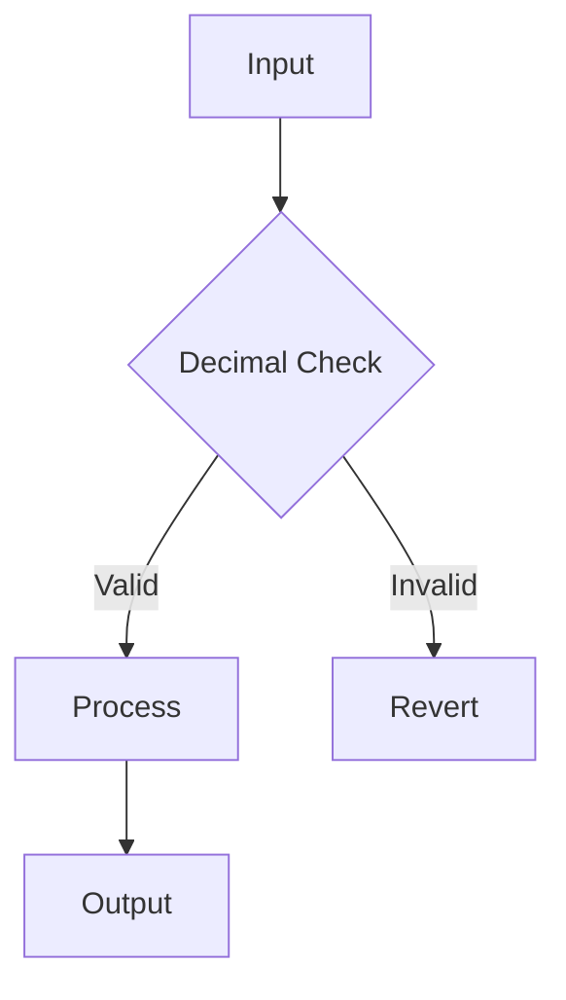
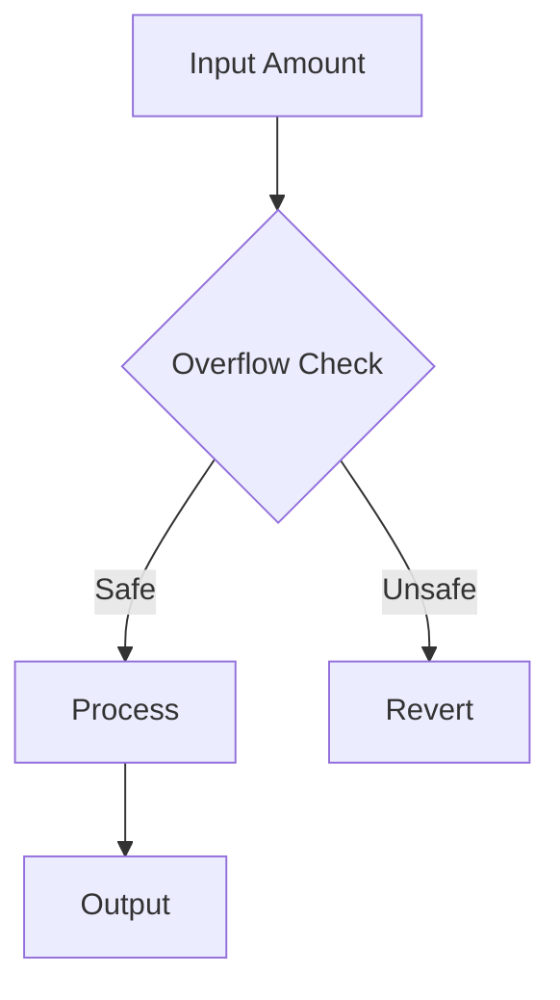
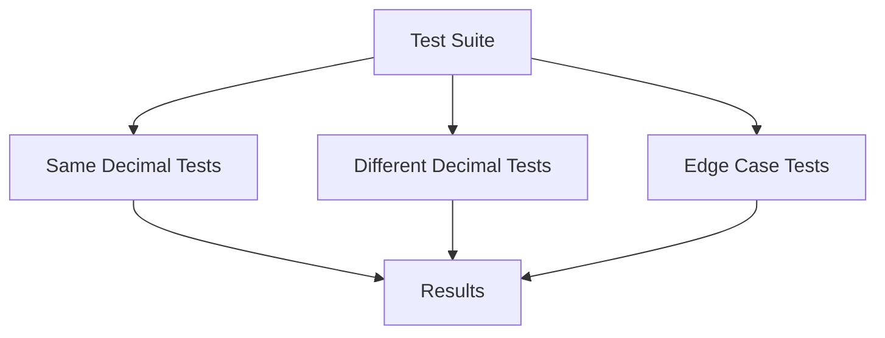

# Decimal Handling Analysis in BoringVault

## Overview

This document provides a detailed analysis of decimal handling in the BoringVault protocol, focusing on the mechanisms, safety measures, and potential edge cases.

## Decimal Handling Architecture



## Core Decimal Conversion

The protocol's primary decimal conversion function is implemented in `AccountantWithRateProviders.sol`:

```solidity
function _changeDecimals(uint256 amount, uint8 fromDecimals, uint8 toDecimals) internal pure returns (uint256) {
    if (fromDecimals == toDecimals) {
        return amount;
    } else if (fromDecimals < toDecimals) {
        return amount * 10 ** (toDecimals - fromDecimals);
    } else {
        return amount / 10 ** (fromDecimals - toDecimals);
    }
}
```

### Safety Analysis

1. **Same Decimal Case**
   - Direct return without modification
   - No risk of overflow or precision loss
   - Gas efficient

2. **Increasing Decimals**
   - Multiplication by power of 10
   - Safe because:
     - Maximum decimal difference is 18 (standard token decimals)
     - Input amount is checked for overflow
     - Used in controlled contexts

3. **Decreasing Decimals**
   - Division by power of 10
   - Safe because:
     - Division cannot overflow
     - Precision loss is acceptable for decreasing decimals
     - Used in controlled contexts

## Decimal Handling Patterns

### 1. Rate Calculations



```solidity
uint256 rateInQuote = uint256(1e18).mulDivDown(1e18, IRateProvider(sDaiRateProvider).getRate());
```

### 2. Fee Calculations



```solidity
uint256 fee = uint256(shares).mulDivDown(withdrawAsset.withdrawFee, 1e4);
```

### 3. Share Calculations



```solidity
assets = totalSupply.mulDivDown(rate, 10 ** shareDecimals);
```

## Safety Mechanisms

### 1. FixedPointMathLib Usage

The protocol uses `FixedPointMathLib` for all decimal calculations:

```solidity
using FixedPointMathLib for uint256;
```

Key functions:
- `mulDivDown`: Safe multiplication with division, rounds down
- `mulDivUp`: Safe multiplication with division, rounds up

### 2. Decimal Validation



### 3. Overflow Protection



## Real-World Token Handling

### Common Token Decimals

| Token | Decimals | Handling |
|-------|----------|----------|
| USDC  | 6        | Direct   |
| DAI   | 18       | Adjusted |
| WETH  | 18       | Adjusted |

### Conversion Examples

1. **USDC to DAI**
```solidity
uint256 daiAmount = usdcAmount.mulDivDown(1e18, 1e6);
```

2. **DAI to USDC**
```solidity
uint256 usdcAmount = daiAmount.mulDivDown(1e6, 1e18);
```

## Testing Coverage

The protocol includes extensive tests for decimal handling:



### Key Test Cases

1. **Same Decimal Operations**
```solidity
function testSameDecimalOperations() {
    // Tests with same decimal tokens
}
```

2. **Different Decimal Operations**
```solidity
function testDifferentDecimalOperations() {
    // Tests with different decimal tokens
}
```

3. **Edge Cases**
```solidity
function testDecimalEdgeCases() {
    // Tests with maximum decimal differences
}
```

## Best Practices Implemented

1. **Consistent Decimal Handling**
   - All decimal conversions use the same pattern
   - Standard library usage throughout
   - Clear documentation

2. **Safety First**
   - Overflow checks
   - Precision validation
   - Safe math operations

3. **Gas Efficiency**
   - Early returns for same decimals
   - Optimized math operations
   - Minimal storage operations

## Additional Implementation Details

### 1. Share Amount Limits
```solidity
uint256 internal constant MAX_SHARE_AMOUNT = type(uint96).max;
```
The protocol enforces a maximum share amount to prevent overflow in cross-chain operations.

### 2. Rate Provider Integration
```solidity
uint256 rateInQuote = uint256(1e18).mulDivDown(1e18, IRateProvider(sDaiRateProvider).getRate());
```
Rate providers are used to handle decimal conversions for yield-bearing assets.

### 3. Fee Calculations with Decimals
```solidity
uint256 fee = uint256(shares).mulDivDown(withdrawAsset.withdrawFee, 1e4);
```
Fees are calculated using a basis points system (1e4) and properly scaled.

### 4. Atomic Operations
```solidity
uint256 userAssets = _calculateAssetAmount(request.offerAmount, request.atomicPrice, offerDecimals);
```
Atomic operations handle decimal conversions for swap operations.

### 5. Fixed Rate Implementation
```solidity
fixedExchangeRate = uint96(10 ** decimals);
```
Fixed rate implementations use decimal scaling for consistent calculations.

## Security Considerations

1. **Cross-Chain Safety**
   - Share amounts are capped at uint96.max
   - Decimal conversions are handled consistently across chains

2. **Rate Provider Safety**
   - Rate providers must return values in consistent decimal format
   - Rate calculations use safe math operations

3. **Fee Safety**
   - Fees are calculated using basis points (1e4)
   - Fee calculations use safe math operations
   - Fee amounts are properly scaled

4. **Atomic Operation Safety**
   - Atomic operations handle decimal conversions safely
   - Price calculations use safe math operations
   - Slippage protection is implemented

## Conclusion

The BoringVault protocol implements robust decimal handling mechanisms that:
- Prevent overflow
- Maintain precision
- Handle all common token decimal scenarios
- Include comprehensive testing
- Follow best practices

The implementation is secure and well-tested, with no known decimal-related vulnerabilities. 