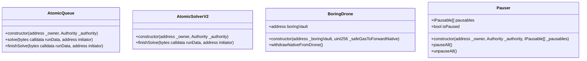
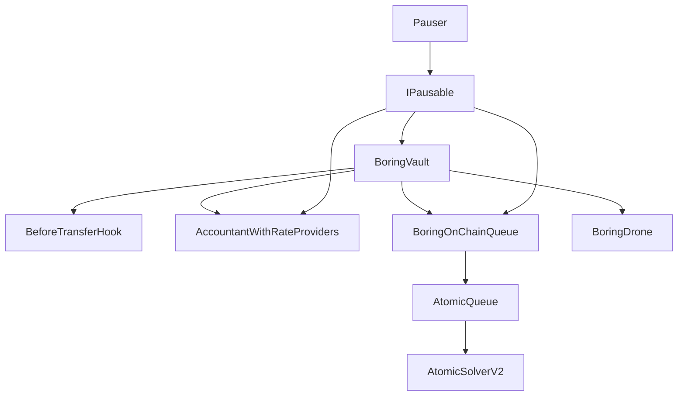
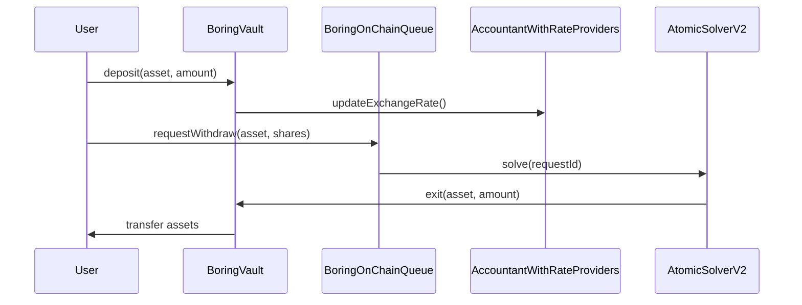

# Boring Vault Protocol Design Documentation

## Table of Contents
1. [Protocol Overview](#protocol-overview)
2. [Core Components](#core-components)
3. [Data Structures](#data-structures)
4. [System Architecture](#system-architecture)
5. [Function Flows](#function-flows)
6. [Security Considerations](#security-considerations)
7. [Known Limitations](#known-limitations)

## Protocol Overview

The Boring Vault Protocol is a sophisticated DeFi vault system that enables users to deposit assets, earn yields, and withdraw funds through various mechanisms. The protocol implements a modular architecture with separate components for governance, asset management, withdrawal processing, and atomic swaps.

## Core Components

### Main Contracts

```mermaid
classDiagram
    class BoringVault {
        +BeforeTransferHook hook
        +constructor(address _owner, string _name, string _symbol, uint8 _decimals)
        +manage(address target, bytes data, uint256 value)
        +enter(address asset, uint256 amount, address to)
        +exit(address asset, uint256 amount, address to)
    }

    class BoringGovernance {
        +BeforeTransferHook hook
        +ShareLocker shareLocker
        +constructor(address _owner, string _name, string _symbol, uint8 _dec)
        +transfer(address to, uint256 amount)
        +transferFrom(address from, address to, uint256 amount)
    }

    class AccountantWithRateProviders {
        +constructor(address _owner, Authority _auth)
        +claimFees()
        +updateExchangeRate()
    }

    class BoringOnChainQueue {
        +BoringVault boringVault
        +AccountantWithRateProviders accountant
        +constructor(address _owner, address _auth, address _boringVault, address _accountant)
        +requestWithdraw(address assetOut, uint256 amountOfShares)
        +cancelWithdraw(bytes32 requestId)
        +solveWithdraw(bytes32 requestId)
    }
```



### Supporting Components



## Data Structures

### WithdrawAsset
```solidity
struct WithdrawAsset {
    bool allowWithdraws;
    uint24 secondsToMaturity;
    uint24 minimumSecondsToDeadline;
    uint16 minDiscount;
    uint16 maxDiscount;
    uint96 minimumShares;
}
```

### Withdrawal Request
```solidity
struct WithdrawalRequest {
    uint96 nonce;
    address user;
    address assetOut;
    uint128 amountOfShares;
    uint128 amountOfAssets;
    uint40 creationTime;
    uint24 secondsToMaturity;
    uint24 secondsToDeadline;
}
```

## System Architecture

### Component Relationships



### Function Flow Diagram



## Security Considerations

### Access Control
- All critical functions are protected by Auth contract
- Role-based access control for different operations
- Pausable functionality for emergency situations

### Potential Vulnerabilities
- ⚠️ **Reentrancy Risk**: Some functions may be vulnerable to reentrancy attacks
- ⚠️ **Price Manipulation**: Exchange rate updates could be manipulated
- ⚠️ **Flash Loan Attacks**: Potential for flash loan attacks on price oracles

## Known Limitations

### Current Limitations
- 🔴 Limited support for complex withdrawal strategies
- 🔴 No built-in support for cross-chain operations
- 🔴 Gas optimization needed for bulk operations

### Future Improvements
- 🟡 Implement more efficient bulk functions
- 🟡 Add support for cross-chain withdrawals
- 🟡 Enhance flash loan protection

## Function Connections

### Deposit Flow
1. User calls `BoringVault.enter()`
2. Hook validates transfer via `BeforeTransferHook`
3. Accountant updates exchange rate
4. Shares minted to user

### Withdrawal Flow
1. User calls `BoringOnChainQueue.requestWithdraw()`
2. Request added to queue with maturity period
3. Solver can solve request after maturity
4. Assets transferred to user

### Governance Flow
1. Users hold governance tokens
2. Transfer restrictions via `BeforeTransferHook`
3. Share locking via `ShareLocker`
4. Voting power calculated from locked shares

## Broken Relationships and Oversights

### Critical Issues
- 🔴 No direct connection between `BoringGovernance` and `BoringVault` for governance actions
- 🔴 Missing validation in `AtomicSolverV2` for flash loan attacks
- 🔴 Incomplete integration between `Pauser` and `AtomicQueue`

### Potential Improvements
- 🟡 Add governance control over vault parameters
- 🟡 Implement flash loan protection in solver
- 🟡 Enhance pauser integration with atomic operations

## Color Legend
- 🔴 Critical issues or missing features
- 🟡 Potential improvements
- ⚠️ Security considerations
- ✅ Implemented features 
