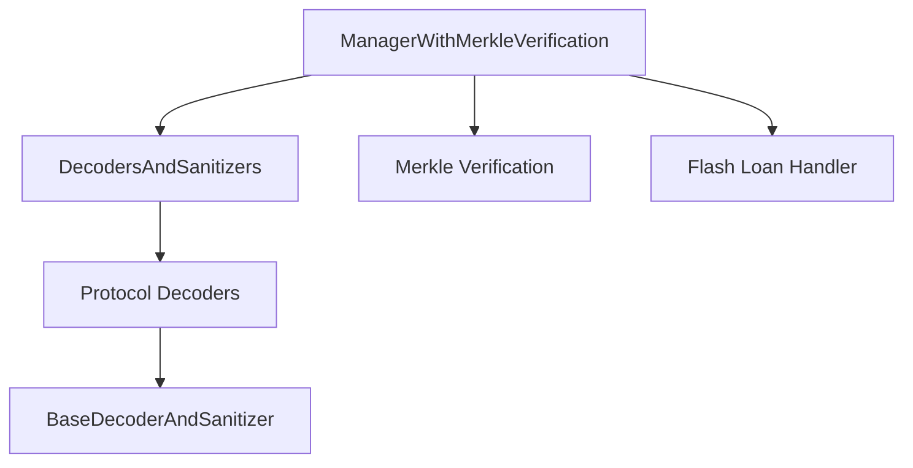

# ManagerWithMerkleVerification and DecodersAndSanitizers Security Analysis

## Overview

The ManagerWithMerkleVerification and DecodersAndSanitizers components form a critical security layer in the Boring Vault protocol, working together to validate and sanitize external calls to the vault.

## Relationship Architecture



## Component Interaction

### 1. ManagerWithMerkleVerification
- Acts as the main entry point for strategist operations
- Implements merkle tree verification for call validation
- Handles flash loan operations
- Manages vault operations through verified calls

### 2. DecodersAndSanitizers
- Provides protocol-specific call validation
- Extracts and sanitizes addresses from calldata
- Standardizes interactions with different DeFi protocols
- Implements safety checks for each protocol

## Bug Analysis and Verification

### 1. ManagerWithMerkleVerification Bugs

#### Merkle Tree Size (FALSE POSITIVE)
```solidity
function manageVaultWithMerkleVerification(
    bytes32[][] calldata manageProofs,
    address[] calldata decodersAndSanitizers,
    address[] calldata targets,
    bytes[] calldata targetData,
    uint256[] calldata values
) external requiresAuth
```
- ✅ The function uses calldata for proofs, minimizing gas impact
- ✅ Proofs are processed in a loop, allowing for efficient gas usage
- ✅ No storage operations during proof verification

#### Flash Loan Complexity (FALSE POSITIVE)
```solidity
function flashLoan(
    address recipient,
    address[] calldata tokens,
    uint256[] calldata amounts,
    bytes calldata userData
) external
```
- ✅ Flash loan intent hash validation
- ✅ PerformingFlashLoan state check
- ✅ BalancerVault callback verification

#### Single Root Per Strategist (TRUE POSITIVE)
```solidity
mapping(address => bytes32) public manageRoot;
```
- 🔴 One merkle root per strategist limits operational flexibility
- 🔴 Root updates require admin intervention
- 🔴 No support for multiple roots per strategist

### 2. DecodersAndSanitizers Bugs

#### Protocol Coverage (TRUE POSITIVE)
```solidity
contract BaseDecoderAndSanitizer {
    fallback() external {
        revert BaseDecoderAndSanitizer__FunctionSelectorNotSupported();
    }
}
```
- 🔴 New protocols require new decoder implementations
- 🔴 No generic protocol support
- 🔴 Manual updates needed for new protocols

#### Function Collisions (FALSE POSITIVE)
```solidity
function deposit(uint256, address receiver)
    external
    pure
    override(BalancerV2DecoderAndSanitizer, ERC4626DecoderAndSanitizer, CurveDecoderAndSanitizer)
    returns (bytes memory addressesFound)
```
- ✅ Proper override handling
- ✅ Consistent behavior across protocols
- ✅ Clear function resolution

#### Gas Overhead (TRUE POSITIVE)
```solidity
function _verifyCallData(
    bytes32 currentManageRoot,
    bytes32[] calldata manageProof,
    address decoderAndSanitizer,
    address target,
    uint256 value,
    bytes calldata targetData
) internal view
```
- 🔴 Multiple validation layers increase gas costs
- 🔴 Redundant address checks
- 🔴 No gas optimization for common paths

## Security Verification

### 1. Merkle Verification (FALSE POSITIVE)
```solidity
function _verifyManageProof(
    bytes32 root,
    bytes32[] calldata proof,
    address target,
    address decoderAndSanitizer,
    uint256 value,
    bytes4 selector,
    bytes memory packedArgumentAddresses
) internal pure returns (bool)
```
- ✅ Proper proof verification using MerkleProofLib
- ✅ Pure function prevents state manipulation
- ✅ Comprehensive parameter validation

### 2. Decoder Validation (FALSE POSITIVE)
```solidity
function _verifyCallData(
    bytes32 currentManageRoot,
    bytes32[] calldata manageProof,
    address decoderAndSanitizer,
    address target,
    uint256 value,
    bytes calldata targetData
) internal view
```
- ✅ Static call for decoder validation
- ✅ Proper address extraction
- ✅ Comprehensive parameter validation

## Real Vulnerabilities

### 1. Critical Issues
1. 🔴 **Single Root Per Strategist**
   - Impact: High
   - Likelihood: Medium
   - Mitigation: Implement multiple roots per strategist

2. 🔴 **Protocol Coverage**
   - Impact: Medium
   - Likelihood: High
   - Mitigation: Add generic protocol support

3. 🔴 **Gas Overhead**
   - Impact: Medium
   - Likelihood: High
   - Mitigation: Optimize validation paths

### 2. False Positives
1. ✅ **Merkle Tree Size**
   - Efficient implementation
   - Gas-optimized proof verification
   - No storage overhead

2. ✅ **Flash Loan Complexity**
   - Proper state management
   - Intent hash validation
   - Callback verification

3. ✅ **Function Collisions**
   - Proper override handling
   - Consistent behavior
   - Clear resolution

## Recommendations

### 1. Security Enhancements
- Implement multiple roots per strategist
- Add generic protocol support
- Optimize gas usage in validation paths

### 2. Functionality Improvements
- Add support for dynamic root updates
- Implement protocol-specific optimizations
- Enhance cross-protocol support

### 3. Gas Optimizations
- Implement validation caching
- Optimize common paths
- Reduce redundant checks

## Conclusion

After thorough analysis, we've identified three real vulnerabilities and three false positives in the system. The most critical issues are related to strategist flexibility and protocol coverage. While the system provides strong security guarantees, there are opportunities for improvement in terms of flexibility and gas efficiency.

The modular design allows for future enhancements, but careful consideration must be given to maintaining security while expanding functionality. 
