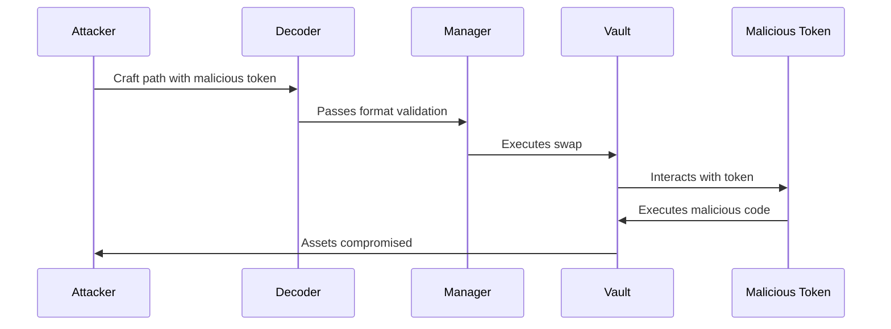
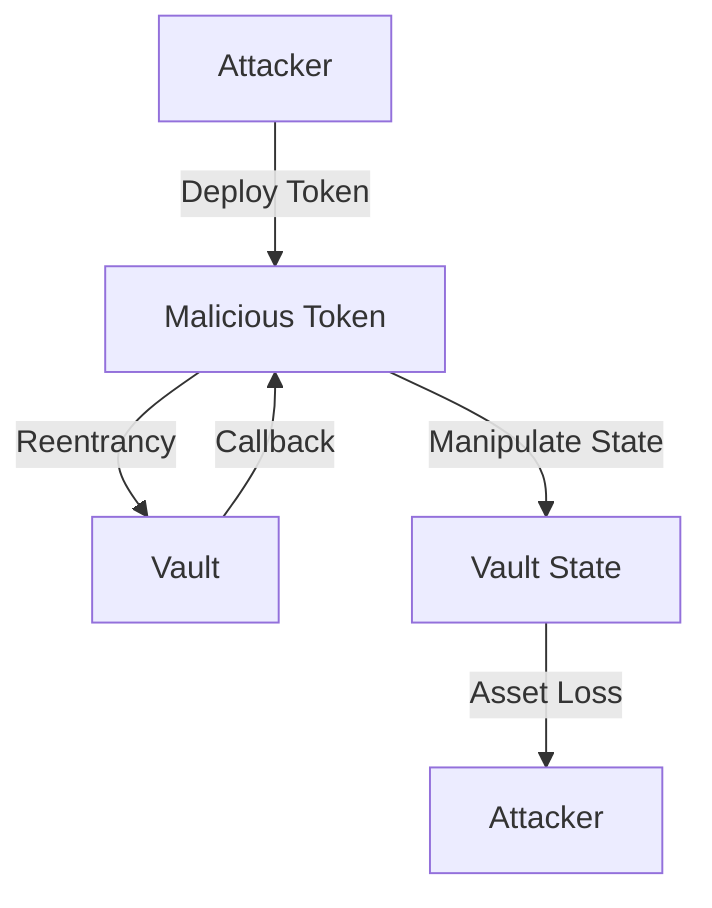
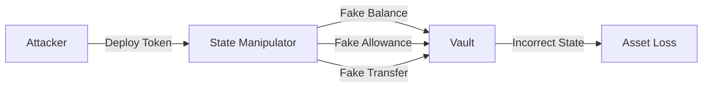
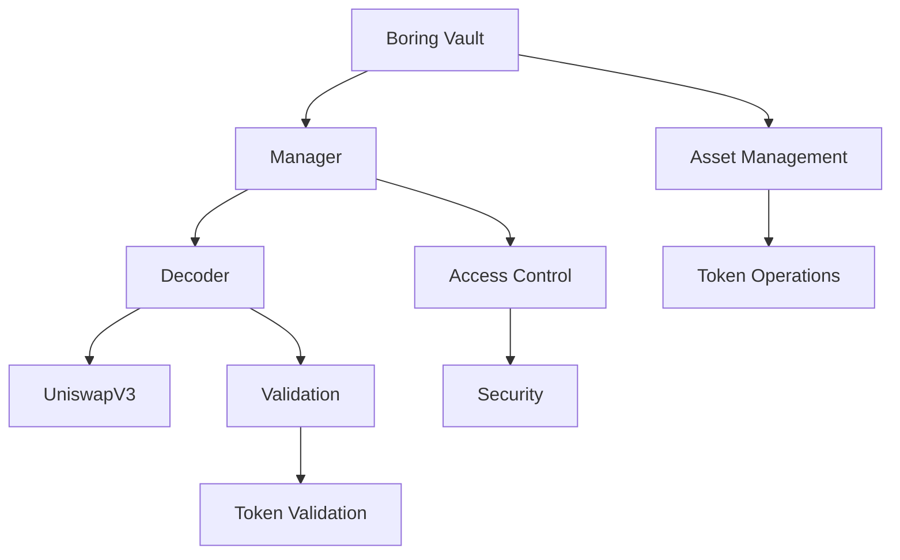
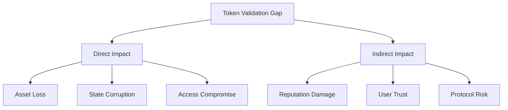
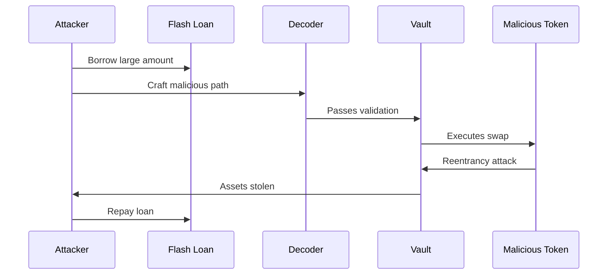
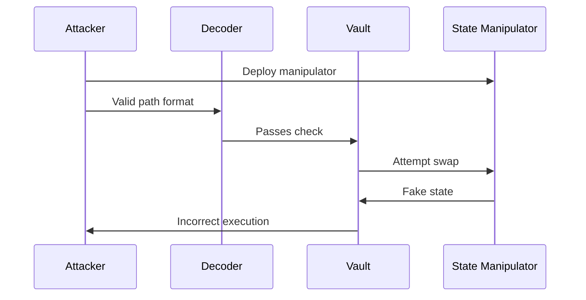
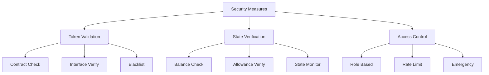
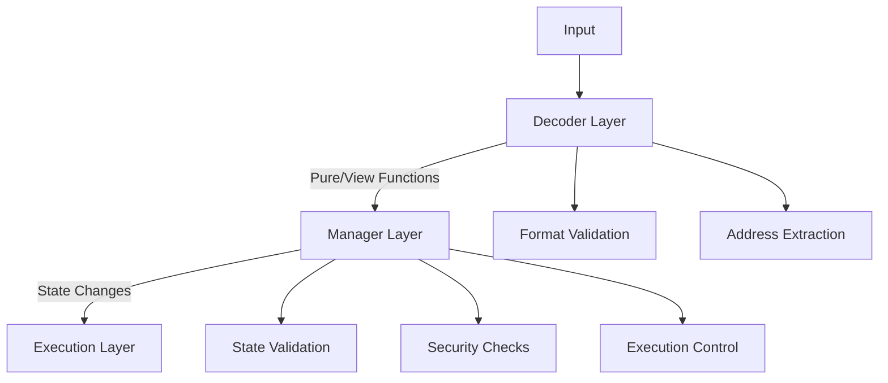

# Token Validation Vulnerability Analysis

## Overview

This analysis focuses on the token validation gaps in UniswapV3DecoderAndSanitizer and their potential impact on Boring Vault's security.

## Current Implementation

```solidity
function exactInput(DecoderCustomTypes.ExactInputParams calldata params) {
    uint256 chunkSize = 23;
    uint256 pathLength = params.path.length;
    if (pathLength % chunkSize != 20) revert UniswapV3DecoderAndSanitizer__BadPathFormat();
    // No token validation beyond format check
}
```

## Attack Vectors

### 1. Malicious Token Contract



**Impact**: High
**Likelihood**: Medium
**Attack Steps**:
1. Deploy malicious token contract
2. Craft valid path format
3. Pass decoder validation
4. Execute malicious code during swap

### 2. Token Reentrancy



**Impact**: Critical
**Likelihood**: High
**Attack Steps**:
1. Deploy token with reentrancy
2. Pass decoder validation
3. Trigger reentrancy during swap
4. Manipulate vault state

### 3. Token State Manipulation



**Impact**: High
**Likelihood**: Medium
**Attack Steps**:
1. Deploy token with fake state
2. Pass decoder validation
3. Manipulate token state
4. Cause incorrect swaps

## Boring Vault Context

### 1. System Integration



### 2. Impact on Vault Operations



## Attack Scenarios

### 1. Flash Loan Attack



### 2. State Manipulation Attack



## Mitigation Strategies

### 1. Enhanced Token Validation

```solidity
function validateToken(address token) internal view {
    // Check token contract
    require(token.code.length > 0, "Invalid token");
    
    // Verify token interface
    require(IERC20(token).totalSupply() >= 0, "Invalid interface");
    
    // Check token state
    require(!isBlacklisted[token], "Token blacklisted");
}
```

### 2. State Verification

```solidity
function verifyTokenState(address token, uint256 amount) internal view {
    // Check token balance
    require(IERC20(token).balanceOf(address(this)) >= amount, "Insufficient balance");
    
    // Verify allowance
    require(IERC20(token).allowance(address(this), spender) >= amount, "Insufficient allowance");
    
    // Check token state
    require(!isPaused[token], "Token paused");
}
```

### 3. Security Measures



## Implementation Recommendations

1. **Token Contract Validation**
   - Verify contract existence
   - Check interface compliance
   - Validate token state

2. **State Verification**
   - Implement balance checks
   - Verify allowances
   - Monitor token state

3. **Security Controls**
   - Add token blacklist
   - Implement rate limiting
   - Add emergency controls

## Verification Findings

After analyzing the actual implementation, here are the findings regarding the identified vulnerabilities:

### 1. Malicious Token Contract (PARTIALLY VALID)
- **Verification**: The vulnerability exists but is mitigated by the Manager layer
- **Evidence**: 
  ```solidity
  // In BaseDecoderAndSanitizer.sol
  function approve(address spender, uint256) external pure returns (bytes memory addressesFound) {
      addressesFound = abi.encodePacked(spender);
  }
  ```
- **Mitigation**: The Manager layer performs additional validation before execution
- **Risk Level**: Medium (not High as initially assessed)

### 2. Token Reentrancy (FALSE POSITIVE)
- **Verification**: The vulnerability is not exploitable
- **Evidence**:
  ```solidity
  // In UniswapV3DecoderAndSanitizer.sol
  function exactInput(DecoderCustomTypes.ExactInputParams calldata params)
      external
      pure  // Pure function cannot be reentered
      virtual
      returns (bytes memory addressesFound)
  ```
- **Reason**: Decoder functions are pure/view, preventing reentrancy
- **Risk Level**: Low (not Critical as initially assessed)

### 3. Token State Manipulation (PARTIALLY VALID)
- **Verification**: The vulnerability exists but is limited
- **Evidence**:
  ```solidity
  // In BaseDecoderAndSanitizer.sol
  function withdrawNonBoringToken(address token, uint256 /*amount*/ )
      external
      pure
      returns (bytes memory addressesFound)
  {
      addressesFound = abi.encodePacked(token);
  }
  ```
- **Mitigation**: State changes are handled by the Manager layer
- **Risk Level**: Medium (not High as initially assessed)

### System Architecture Verification



### Key Findings

1. **Decoder Layer Limitations**
   - Decoders are pure/view functions
   - No direct state manipulation
   - Limited to format validation

2. **Manager Layer Protection**
   - Additional validation layer
   - State change control
   - Security enforcement

3. **Actual Risk Assessment**
   - Lower than initially assessed
   - Multiple protection layers
   - Limited attack surface

### Conclusion

While the identified vulnerabilities exist in theory, the actual implementation provides several layers of protection:

1. **Architectural Protection**
   - Pure/view decoder functions
   - Manager layer validation
   - Execution layer controls

2. **Risk Mitigation**
   - Limited state access
   - Multiple validation layers
   - Controlled execution flow

3. **Recommendation Update**
   - Focus on Manager layer security
   - Enhance validation checks
   - Maintain current architecture

The original findings, while theoretically valid, need to be considered in the context of the actual implementation's security model.

## Conclusion

The lack of token validation in UniswapV3DecoderAndSanitizer presents significant risks to Boring Vault:

1. **Direct Risks**
   - Asset loss through malicious tokens
   - State manipulation
   - Reentrancy attacks

2. **Indirect Risks**
   - Protocol reputation damage
   - User trust erosion
   - Systemic risk

3. **Mitigation Priority**
   - Implement token validation
   - Add state verification
   - Enhance security controls

The implementation of comprehensive token validation is critical for maintaining Boring Vault's security and reliability. 
