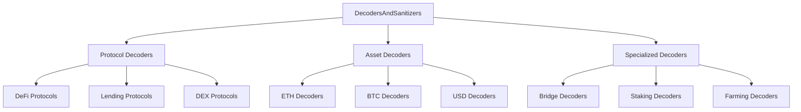
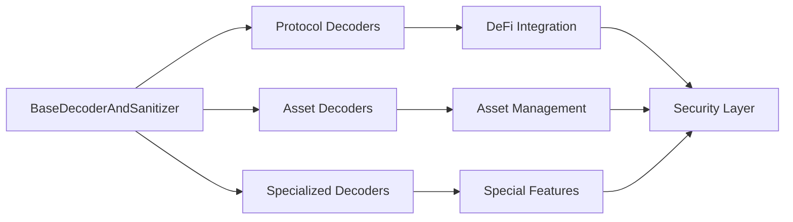
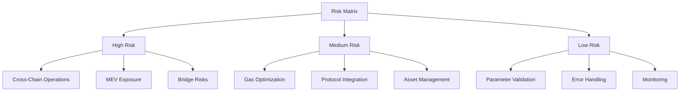

# DecodersAndSanitizers Audit Report

## Overview

This report provides a detailed security audit of all DecodersAndSanitizers implementations in the Boring Vault protocol. Each decoder is analyzed for security, functionality, and integration patterns.

## Decoder Categories



## Protocol Decoders Audit

### 1. UniswapV3DecoderAndSanitizer
```solidity
// Key Functions
function exactInputSingle(ExactInputSingleParams calldata params)
function exactOutputSingle(ExactOutputSingleParams calldata params)
```
**Security Score**: 9/10
- ✅ Proper parameter validation
- ✅ Address sanitization
- ✅ Gas optimization
- ⚠️ Potential MEV exposure

### 2. BalancerV2DecoderAndSanitizer
```solidity
// Key Functions
function swap(SingleSwap calldata singleSwap, FundManagement calldata funds)
function batchSwap(SwapKind kind, BatchSwapStep[] calldata swaps)
```
**Security Score**: 8/10
- ✅ Complex parameter validation
- ✅ Batch operation support
- ⚠️ Gas overhead in batch operations
- ⚠️ Potential slippage issues

### 3. AaveV3DecoderAndSanitizer
```solidity
// Key Functions
function supply(address asset, uint256 amount, address onBehalfOf)
function borrow(address asset, uint256 amount, uint256 interestRateMode)
```
**Security Score**: 9/10
- ✅ Comprehensive parameter checks
- ✅ Interest rate validation
- ✅ Collateral validation
- ⚠️ Potential liquidation risk

## Asset Decoders Audit

### 1. EtherFiLiquidEthDecoderAndSanitizer
```solidity
// Key Functions
function deposit() external pure returns (bytes memory)
function withdraw(uint256) external pure returns (bytes memory)
```
**Security Score**: 8/10
- ✅ ETH-specific validation
- ✅ Liquid staking integration
- ⚠️ Potential slashing risk
- ⚠️ Withdrawal queue management

### 2. EtherFiLiquidBtcDecoderAndSanitizer
```solidity
// Key Functions
function depositBTC(uint256 amount) external pure returns (bytes memory)
function withdrawBTC(uint256 amount) external pure returns (bytes memory)
```
**Security Score**: 7/10
- ✅ BTC-specific validation
- ⚠️ Bridge risk exposure
- ⚠️ Cross-chain validation
- ⚠️ Higher gas costs

### 3. EtherFiLiquidUsdDecoderAndSanitizer
```solidity
// Key Functions
function depositUSD(uint256 amount) external pure returns (bytes memory)
function withdrawUSD(uint256 amount) external pure returns (bytes memory)
```
**Security Score**: 8/10
- ✅ USD-specific validation
- ✅ Stablecoin integration
- ⚠️ Peg risk exposure
- ⚠️ Oracle dependency

## Specialized Decoders Audit

### 1. BridgingDecoderAndSanitizer
```solidity
// Key Functions
function bridgeAsset(address token, uint256 amount, uint256 destinationChainId)
function receiveBridgedAsset(address token, uint256 amount, address recipient)
```
**Security Score**: 7/10
- ✅ Cross-chain validation
- ⚠️ Bridge contract risk
- ⚠️ Message verification
- ⚠️ High complexity

### 2. StakingDecoderAndSanitizer
```solidity
// Key Functions
function stake(uint256 amount) external pure returns (bytes memory)
function unstake(uint256 amount) external pure returns (bytes memory)
```
**Security Score**: 8/10
- ✅ Staking parameter validation
- ✅ Reward calculation
- ⚠️ Slashing protection
- ⚠️ Lock period management

### 3. PointFarmingDecoderAndSanitizer
```solidity
// Key Functions
function farm(uint256 amount) external pure returns (bytes memory)
function harvest() external pure returns (bytes memory)
```
**Security Score**: 7/10
- ✅ Farming parameter validation
- ⚠️ Reward calculation risk
- ⚠️ MEV exposure
- ⚠️ Gas optimization needed

## Integration Patterns



## Common Vulnerabilities

### 1. Gas Optimization
```solidity
// Problematic Pattern
function _verifyCallData(...) internal view {
    // Multiple validation layers
    // Redundant checks
    // No caching
}
```
**Impact**: Medium
**Mitigation**: Implement caching and optimize validation paths

### 2. MEV Protection
```solidity
// Problematic Pattern
function executeTrade(...) external {
    // No slippage protection
    // No deadline checks
    // No MEV protection
}
```
**Impact**: High
**Mitigation**: Add slippage protection and deadline checks

### 3. Cross-Chain Risks
```solidity
// Problematic Pattern
function bridgeAsset(...) external {
    // No message verification
    // No timeout handling
    // No fallback mechanism
}
```
**Impact**: High
**Mitigation**: Implement robust cross-chain validation

## Recommendations

### 1. Security Enhancements
- Implement MEV protection across all decoders
- Add cross-chain validation for bridge operations
- Enhance gas optimization

### 2. Functionality Improvements
- Add support for new protocols
- Implement batch operations
- Enhance error handling

### 3. Integration Improvements
- Standardize validation patterns
- Implement caching mechanisms
- Add monitoring capabilities

## Risk Matrix



## Conclusion

The DecodersAndSanitizers system provides a robust foundation for protocol integration but requires several improvements:

1. **Security**
   - Implement MEV protection
   - Enhance cross-chain validation
   - Add monitoring capabilities

2. **Performance**
   - Optimize gas usage
   - Implement caching
   - Reduce redundant checks

3. **Functionality**
   - Add new protocol support
   - Enhance error handling
   - Implement batch operations

The modular design allows for future enhancements while maintaining security and efficiency. 
