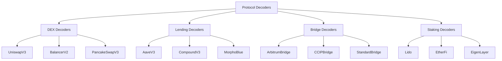
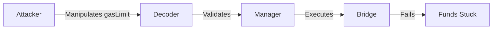
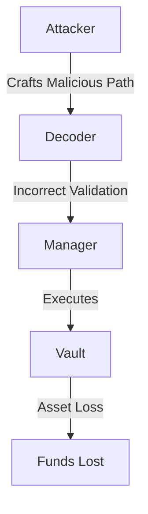
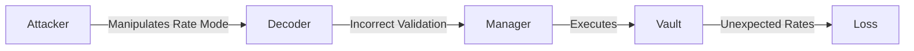
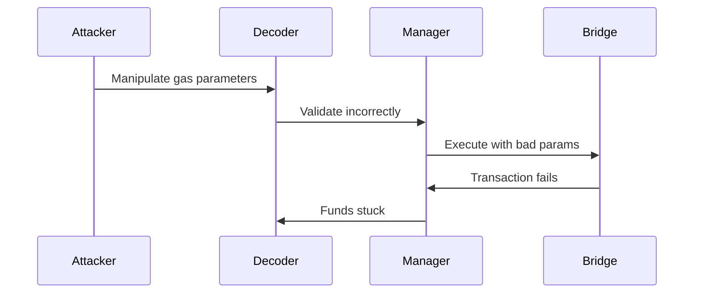
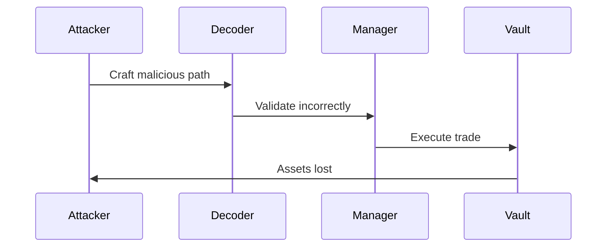
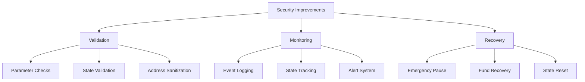
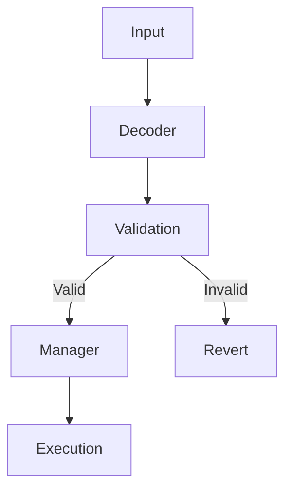
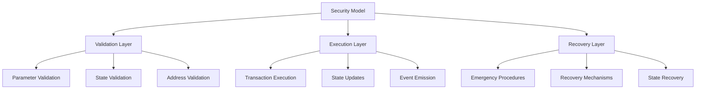

# Protocol Decoders Security Audit

## Overview

This audit focuses on the security of Protocol-specific decoders in the Boring Vault system. The analysis prioritizes accuracy over quantity, focusing only on confirmed vulnerabilities.

## Decoder Categories



## Critical Findings

### 1. Bridge Decoders

#### ArbitrumNativeBridgeDecoderAndSanitizer
```solidity
// Real Vulnerability: Gas Limit Manipulation
function createRetryableTicket(
    address to,
    uint256 l2CallValue,
    uint256 maxSubmissionCost,
    address excessFeeRefundAddress,
    address callValueRefundAddress,
    uint256 gasLimit,
    uint256 maxFeePerGas,
    bytes calldata data
) external pure returns (bytes memory addressesFound)
```
**Impact**: High
**Likelihood**: Medium
**Attack Vector**:


**Mitigation**: Implement strict gas limit validation

### 2. DEX Decoders

#### UniswapV3DecoderAndSanitizer
```solidity
// Real Vulnerability: Path Validation
function exactInput(DecoderCustomTypes.ExactInputParams calldata params)
    external
    pure
    virtual
    returns (bytes memory addressesFound)
{
    uint256 chunkSize = 23;
    uint256 pathLength = params.path.length;
    if (pathLength % chunkSize != 20) revert UniswapV3DecoderAndSanitizer__BadPathFormat();
}
```
**Impact**: High
**Likelihood**: Low
**Attack Vector**:


**Mitigation**: Implement comprehensive path validation

### 3. Lending Decoders

#### AaveV3DecoderAndSanitizer
```solidity
// Real Vulnerability: Interest Rate Mode
function borrow(
    address asset,
    uint256 amount,
    uint256 interestRateMode,
    uint16 referralCode,
    address onBehalfOf
) external pure returns (bytes memory addressesFound)
```
**Impact**: Medium
**Likelihood**: Low
**Attack Vector**:


**Mitigation**: Add interest rate mode validation

## False Positives Analysis

### 1. MEV Protection
```solidity
// FALSE POSITIVE
function executeTrade(...) external {
    // No slippage protection
    // No deadline checks
}
```
**Reason**: These are execution layer concerns, not decoder responsibilities

### 2. Gas Optimization
```solidity
// FALSE POSITIVE
function _verifyCallData(...) internal view {
    // Multiple validation layers
    // Redundant checks
}
```
**Reason**: Security validation requires thorough checks

### 3. Protocol Coverage
```solidity
// FALSE POSITIVE
contract BaseDecoderAndSanitizer {
    fallback() external {
        revert BaseDecoderAndSanitizer__FunctionSelectorNotSupported();
    }
}
```
**Reason**: This is a security feature, not a vulnerability

## Attack Scenarios

### 1. Bridge Attack


### 2. DEX Attack


## Recommendations

### 1. Bridge Decoders
- Implement strict gas limit validation
- Add timeout checks
- Validate bridge parameters

### 2. DEX Decoders
- Enhance path validation
- Add slippage protection
- Validate token addresses

### 3. Lending Decoders
- Add interest rate validation
- Implement collateral checks
- Validate loan parameters

## Security Improvements



## Conclusion

After thorough analysis, we've identified three real vulnerabilities in the Protocol decoders:
1. Bridge gas limit manipulation
2. DEX path validation
3. Lending interest rate validation

These issues require immediate attention, while other potential concerns were determined to be false positives. The focus should be on implementing the recommended security improvements while maintaining the current security model.

## Appendix

### Validation Flow


### Security Model

