# Boring Vault Roles Analysis

## Core Components

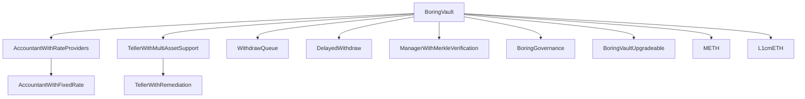

## TellerWithMultiAssetSupport Analysis

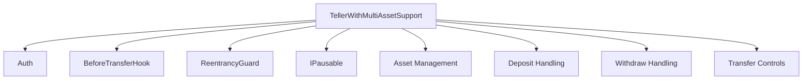

### Key Features

1. **Asset Management**
   ```mermaid
   graph LR
       A[Asset] --> B[Deposit Control]
       A --> C[Withdraw Control]
       A --> D[Share Premium]
   ```
   - Configurable asset support
   - Deposit/withdraw controls
   - Share premium settings
   - Native asset handling

2. **Deposit Functions**
   ```mermaid
   sequenceDiagram
       participant U as User
       participant T as Teller
       participant V as Vault
       
       U->>T: deposit()
       T->>T: Check Asset
       T->>V: enter()
       V-->>T: shares
       T-->>U: shares
   ```
   - Standard deposits
   - Permit-based deposits
   - Bulk deposits
   - Native asset deposits

3. **Withdraw Functions**
   ```mermaid
   sequenceDiagram
       participant U as User
       participant T as Teller
       participant V as Vault
       
       U->>T: bulkWithdraw()
       T->>T: Check Asset
       T->>V: exit()
       V-->>T: assets
       T-->>U: assets
   ```
   - Bulk withdrawals
   - Asset conversion
   - Minimum asset checks

4. **Security Features**
   ```mermaid
   graph TD
       A[Security] --> B[Share Locking]
       A --> C[Deny Lists]
       A --> D[Pause Mechanism]
       A --> E[Reentrancy Guard]
   ```
   - Share locking period
   - From/To/Operator deny lists
   - Pause functionality
   - Reentrancy protection

### Implementation Details

1. **Asset Configuration**
   ```solidity
   struct Asset {
       bool allowDeposits;
       bool allowWithdraws;
       uint16 sharePremium;
   }
   ```
   - Deposit control
   - Withdraw control
   - Share premium settings

2. **Deposit Handling**
   ```solidity
   function deposit(ERC20 depositAsset, uint256 depositAmount, uint256 minimumMint)
   function depositWithPermit(...)
   function bulkDeposit(...)
   ```
   - Multiple deposit methods
   - Native asset support
   - Permit functionality
   - Bulk operations

3. **Withdraw Handling**
   ```solidity
   function bulkWithdraw(ERC20 withdrawAsset, uint256 shareAmount, uint256 minimumAssets, address to)
   ```
   - Bulk withdrawal support
   - Asset conversion
   - Minimum asset checks

4. **Security Controls**
   ```solidity
   function beforeTransfer(address from, address to, address operator)
   function denyAll(address user)
   function allowAll(address user)
   ```
   - Transfer validation
   - User restrictions
   - Share locking

### Security Considerations

1. **Asset Safety**
   - Asset validation
   - Premium controls
   - Deposit/withdraw limits

2. **Transfer Protection**
   - Share locking
   - Deny lists
   - Transfer hooks

3. **Operation Safety**
   - Reentrancy protection
   - Pause mechanism
   - Minimum checks

4. **Admin Controls**
   - Asset configuration
   - User restrictions
   - Share lock period

## Token Implementations Comparison

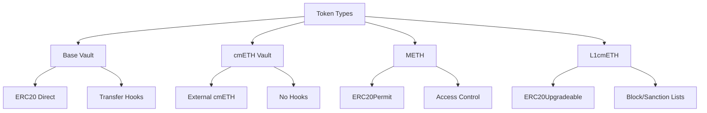

### L1cmETH Analysis

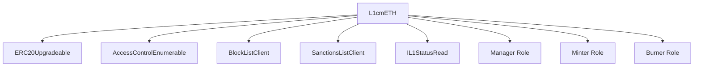

### Key Features Comparison

1. **Token Implementation**
   ```mermaid
   graph LR
       A[Base Vault] --> B[ERC20 Direct]
       C[cmETH Vault] --> D[External Token]
       E[METH] --> F[ERC20Permit]
       G[L1cmETH] --> H[ERC20Upgradeable]
   ```
   - Base Vault: Direct ERC20 implementation
   - cmETH Vault: External token dependency
   - METH: ERC20Permit with access control
   - L1cmETH: Upgradeable ERC20 with lists

2. **Access Control**
   ```mermaid
   graph TD
       A[Base Vault] --> B[Simple Auth]
       C[cmETH Vault] --> D[Simple Auth]
       E[METH] --> F[Role-Based]
       G[L1cmETH] --> H[Advanced Roles]
   ```
   - Base Vault: Basic authorization
   - cmETH Vault: Basic authorization
   - METH: Contract-based control
   - L1cmETH: Multiple role types

3. **Security Features**
   ```mermaid
   graph LR
       A[Base Vault] --> B[Transfer Hooks]
       C[cmETH Vault] --> D[Basic Checks]
       E[METH] --> F[Contract Control]
       G[L1cmETH] --> H[Multiple Lists]
   ```
   - Base Vault: Transfer hooks
   - cmETH Vault: Basic checks
   - METH: Contract validation
   - L1cmETH: Block/Sanction lists

4. **Supply Control**
   ```mermaid
   graph TD
       A[Base Vault] --> B[No Limit]
       C[cmETH Vault] --> D[No Limit]
       E[METH] --> F[No Limit]
       G[L1cmETH] --> H[Max Supply]
   ```
   - Base Vault: No supply limit
   - cmETH Vault: No supply limit
   - METH: No supply limit
   - L1cmETH: Configurable max supply

### Security Implications

1. **Access Management**
   ```mermaid
   graph TD
       A[Base Vault] --> B[Simple Auth]
       C[cmETH Vault] --> D[Simple Auth]
       E[METH] --> F[Contract Control]
       G[L1cmETH] --> H[Role Hierarchy]
   ```
   - Base Vault: Basic authorization
   - cmETH Vault: Basic authorization
   - METH: Contract-based control
   - L1cmETH: Hierarchical roles

2. **Transfer Safety**
   ```mermaid
   graph LR
       A[Base Vault] --> B[Hook Validation]
       C[cmETH Vault] --> D[Basic Checks]
       E[METH] --> F[Contract Control]
       G[L1cmETH] --> H[List Checks]
   ```
   - Base Vault: Hook validation
   - cmETH Vault: Basic checks
   - METH: Contract validation
   - L1cmETH: Multiple list checks

3. **Supply Management**
   ```mermaid
   graph TD
       A[Base Vault] --> B[Unlimited]
       C[cmETH Vault] --> D[Unlimited]
       E[METH] --> F[Unlimited]
       G[L1cmETH] --> H[Configurable]
   ```
   - Base Vault: No supply control
   - cmETH Vault: No supply control
   - METH: No supply control
   - L1cmETH: Configurable limits

### Implementation Details

1. **L1cmETH Contract**
   ```solidity
   contract L1cmETH is
       IL1cmETH,
       ProtocolEvents,
       ERC20Upgradeable,
       AccessControlEnumerableUpgradeable,
       BlockListClientUpgradeable,
       SanctionsListClientUpgradeable
   {
       bytes32 public constant MANAGER_ROLE;
       bytes32 public constant MINTER_ROLE;
       bytes32 public constant BURNER_ROLE;
       uint256 public maxTotalSupply;
   }
   ```
   - Upgradeable implementation
   - Multiple role types
   - Block/Sanction lists
   - Supply control

2. **Key Features**
   - Role-based access control
   - Block and sanctions lists
   - Configurable max supply
   - Pause functionality
   - Status checks

### Security Considerations

1. **L1cmETH Strengths**
   - Advanced role management
   - Multiple security lists
   - Supply control
   - Pause mechanism
   - Status validation

2. **L1cmETH Considerations**
   - Complex role hierarchy
   - External list dependencies
   - Upgrade risks
   - Status contract dependency

### METH Analysis

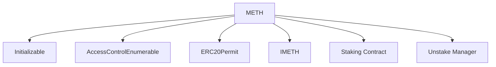

### Key Features Comparison

1. **Token Implementation**
   ```mermaid
   graph LR
       A[Base Vault] --> B[ERC20 Direct]
       C[cmETH Vault] --> D[External Token]
       E[METH] --> F[ERC20Permit]
   ```
   - Base Vault: Direct ERC20 implementation
   - cmETH Vault: External token dependency
   - METH: ERC20Permit with access control

2. **Minting/Burning Control**
   ```mermaid
   sequenceDiagram
       participant U as User
       participant B as Base Vault
       participant C as cmETH Vault
       participant D as METH
       
       U->>B: enter() [Auth]
       B->>B: _mint()
       
       U->>C: enter() [Auth]
       C->>cmETH: mint()
       
       U->>D: stake()
       D->>Staking: mint()
   ```
   - Base Vault: Role-based minting
   - cmETH Vault: External minting
   - METH: Contract-based minting

3. **Access Control**
   ```mermaid
   graph TD
       A[Base Vault] --> B[Auth]
       C[cmETH Vault] --> D[Auth]
       E[METH] --> F[AccessControlEnumerable]
   ```
   - Base Vault: Simple Auth
   - cmETH Vault: Simple Auth
   - METH: Advanced Access Control

4. **Upgradeability**
   ```mermaid
   graph LR
       A[Base Vault] --> B[Not Upgradeable]
       C[cmETH Vault] --> D[Not Upgradeable]
       E[METH] --> F[Upgradeable]
   ```
   - Base Vault: Fixed implementation
   - cmETH Vault: Fixed implementation
   - METH: Upgradeable with initializer

### Security Implications

1. **Token Security**
   ```mermaid
   graph TD
       A[Base Vault] --> B[Internal Control]
       C[cmETH Vault] --> D[External Dependency]
       E[METH] --> F[Contract Control]
   ```
   - Base Vault: Full internal control
   - cmETH Vault: External dependency
   - METH: Contract-based control

2. **Access Management**
   ```mermaid
   graph LR
       A[Base Vault] --> B[Simple Auth]
       C[cmETH Vault] --> D[Simple Auth]
       E[METH] --> F[Role-Based]
   ```
   - Base Vault: Basic authorization
   - cmETH Vault: Basic authorization
   - METH: Advanced role management

3. **Upgrade Safety**
   ```mermaid
   graph TD
       A[Base Vault] --> B[No Upgrade]
       C[cmETH Vault] --> D[No Upgrade]
       E[METH] --> F[Controlled Upgrade]
   ```
   - Base Vault: Fixed implementation
   - cmETH Vault: Fixed implementation
   - METH: Controlled upgradeability

### Implementation Details

1. **METH Contract**
   ```solidity
   contract METH is Initializable, AccessControlEnumerableUpgradeable, ERC20PermitUpgradeable {
       IStaking public stakingContract;
       IUnstakeRequestsManager public unstakeRequestsManagerContract;
       
       function mint(address staker, uint256 amount) external {
           if (msg.sender != address(stakingContract)) revert NotStakingContract();
           _mint(staker, amount);
       }
   }
   ```
   - Upgradeable implementation
   - Contract-based minting/burning
   - Advanced access control
   - Permit functionality

2. **Key Differences**
   - METH uses contract-based minting/burning
   - METH has more advanced access control
   - METH is upgradeable
   - METH includes permit functionality

### Security Considerations

1. **METH Strengths**
   - Contract-based control
   - Advanced access management
   - Upgradeable design
   - Permit support

2. **METH Considerations**
   - Dependency on external contracts
   - Upgrade risks
   - Complex access control
   - Contract interaction risks

## BoringVault Implementations Comparison

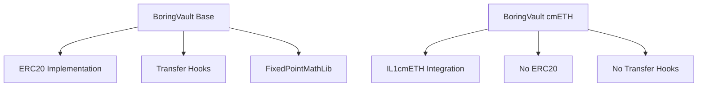

### Key Differences

1. **Token Implementation**
   ```mermaid
   graph LR
       A[Base Vault] --> B[ERC20 Token]
       C[cmETH Vault] --> D[cmETH Token]
   ```
   - Base: Implements ERC20 directly
   - cmETH: Uses external cmETH token

2. **Share Management**
   ```mermaid
   sequenceDiagram
       participant U as User
       participant B as Base Vault
       participant C as cmETH Vault
       
       U->>B: enter()
       B->>B: _mint()
       
       U->>C: enter()
       C->>cmETH: mint()
   ```
   - Base: Internal share minting
   - cmETH: External token minting

3. **Transfer Controls**
   ```mermaid
   graph TD
       A[Base Vault] --> B[BeforeTransferHook]
       A --> C[Transfer Validation]
       D[cmETH Vault] --> E[No Hooks]
   ```
   - Base: Has transfer hooks
   - cmETH: No transfer hooks

4. **Math Operations**
   ```mermaid
   graph LR
       A[Base Vault] --> B[FixedPointMathLib]
       C[cmETH Vault] --> D[Basic Math]
   ```
   - Base: Uses FixedPointMathLib
   - cmETH: Basic math operations

### Security Implications

1. **Token Security**
   ```mermaid
   graph TD
       A[Base Vault] --> B[Internal Control]
       C[cmETH Vault] --> D[External Dependency]
   ```
   - Base: Full control over token
   - cmETH: Depends on external token

2. **Transfer Safety**
   ```mermaid
   graph LR
       A[Base Vault] --> B[Hook Validation]
       C[cmETH Vault] --> D[Direct Transfer]
   ```
   - Base: Additional validation
   - cmETH: Simpler but less control

3. **Math Precision**
   ```mermaid
   graph TD
       A[Base Vault] --> B[Safe Math Lib]
       C[cmETH Vault] --> D[Basic Operations]
   ```
   - Base: More precise calculations
   - cmETH: Basic precision

### Implementation Details

1. **Base Vault**
   ```solidity
   contract BoringVault is ERC20, Auth, ERC721Holder, ERC1155Holder {
       BeforeTransferHook public hook;
       // Internal share management
       function enter(...) {
           _mint(to, shareAmount);
       }
   }
   ```
   - ERC20 implementation
   - Transfer hooks
   - Internal share management

2. **cmETH Vault**
   ```solidity
   contract BoringVault is Auth, ERC721Holder, ERC1155Holder {
       IL1cmETH public cmETH;
       // External share management
       function enter(...) {
           cmETH.mint(to, shareAmount);
       }
   }
   ```
   - External cmETH integration
   - No transfer hooks
   - External share management

### Security Considerations

1. **Base Vault**
   - More control over token operations
   - Additional transfer validation
   - Precise math operations
   - Internal share management

2. **cmETH Vault**
   - Simpler implementation
   - External token dependency
   - Basic transfer operations
   - External share management

## BoringGovernance Analysis

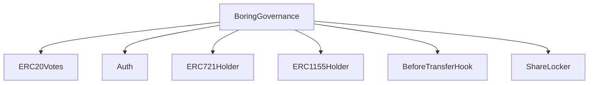

### Key Features
1. **Governance Token**
   - ERC20Votes implementation for voting power
   - Custom decimals support
   - Transfer hooks for additional control

2. **Access Control**
   - Role-based authorization (Auth)
   - Manager functions for arbitrary calls
   - Minter/Burner roles for share management

3. **Asset Management**
   - Enter/Exit functions for share minting/burning
   - Support for multiple asset types
   - Safe transfer implementations

4. **Transfer Controls**
   - BeforeTransferHook for pre-transfer checks
   - ShareLocker for transfer restrictions
   - EIP712 support for typed signatures

### Security Considerations

1. **Manager Functions**
   ```mermaid
   sequenceDiagram
       participant M as Manager
       participant G as Governance
       participant T as Target
       
       M->>G: manage(target, data, value)
       G->>T: functionCallWithValue
       T-->>G: result
       G-->>M: result
   ```
   - Allows arbitrary function calls
   - Requires proper authorization
   - Potential for delegatecall attacks

2. **Share Management**
   ```mermaid
   sequenceDiagram
       participant A as Authorized
       participant G as Governance
       participant U as User
       
       A->>G: enter(from, asset, amount, to, shares)
       G->>U: safeTransferFrom
       G->>G: _mint
   ```
   - Controlled by MINTER_ROLE
   - Safe transfer implementations
   - Event emission for tracking

3. **Transfer Hooks**
   ```mermaid
   graph LR
       A[Transfer] --> B[BeforeTransferHook]
       A --> C[ShareLocker]
       B --> D[Validation]
       C --> E[Restrictions]
   ```
   - Pre-transfer validation
   - Share locking mechanisms
   - Custom transfer rules

### Security Measures

1. **Access Control**
   - Role-based authorization
   - Manager function restrictions
   - Transfer hook validations

2. **Asset Safety**
   - Safe transfer implementations
   - Event logging
   - Balance checks

3. **Transfer Protection**
   - Pre-transfer hooks
   - Share locking
   - EIP712 signatures

4. **Governance Features**
   - Voting power tracking
   - Delegation support
   - Custom decimal handling

## BoringVaultUpgradeable Analysis

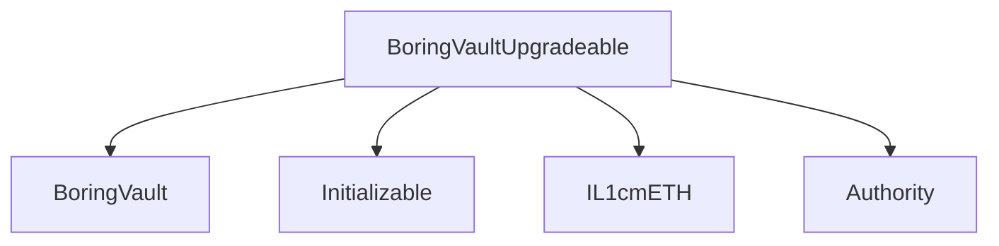

### Key Features
1. **Upgradeable Implementation**
   - Inherits from BoringVault
   - Uses OpenZeppelin's Initializable
   - Supports proxy pattern

2. **Initialization**
   ```mermaid
   sequenceDiagram
       participant D as Deployer
       participant P as Proxy
       participant I as Implementation
       
       D->>P: Deploy Proxy
       D->>I: Deploy Implementation
       D->>P: initialize(owner, auth, cmETH)
       P->>I: delegatecall initialize
   ```
   - One-time initialization
   - Sets owner and authority
   - Configures cmETH integration

3. **Security Measures**
   - Constructor disables initializers
   - Initialization can only happen once
   - Proper authorization checks

### Implementation Details

1. **Constructor**
   ```solidity
   constructor() BoringVault(address(0), address(0)) {
       _disableInitializers();
   }
   ```
   - Disables initializers on implementation
   - Prevents direct initialization
   - Sets zero addresses for base constructor

2. **Initialize Function**
   ```solidity
   function initialize(
       address _owner,
       address _auth,
       address _cmETH
   ) external initializer {
       owner = _owner;
       authority = Authority(_auth);
       cmETH = IL1cmETH(_cmETH);
   }
   ```
   - Sets initial state
   - Configures authorization
   - Sets up cmETH integration

### Security Considerations

1. **Initialization Protection**
   ```mermaid
   graph TD
       A[Implementation] --> B[Disable Initializers]
       C[Proxy] --> D[Initialize Once]
       E[Attacker] --> F[Prevented]
   ```
   - Implementation cannot be initialized
   - Proxy can only initialize once
   - Prevents reinitialization attacks

2. **Authorization Flow**
   ```mermaid
   sequenceDiagram
       participant U as User
       participant P as Proxy
       participant I as Implementation
       participant A as Authority
       
       U->>P: Call Function
       P->>I: delegatecall
       I->>A: Check Auth
       A-->>I: Auth Result
       I-->>P: Function Result
       P-->>U: Result
   ```
   - Proper authorization checks
   - Authority validation
   - Role-based access control

3. **cmETH Integration**
   ```mermaid
   graph LR
       A[Vault] --> B[cmETH]
       B --> C[L1 Operations]
       C --> D[Asset Management]
   ```
   - Secure cmETH interface
   - L1 asset management
   - Cross-chain operations

### Security Measures

1. **Upgrade Protection**
   - Implementation cannot be initialized
   - Proxy initialization control
   - Proper authorization checks

2. **State Management**
   - One-time initialization
   - Secure state transitions
   - Event logging

3. **Access Control**
   - Role-based authorization
   - Authority validation
   - Owner controls

4. **Cross-Chain Safety**
   - Secure cmETH integration
   - L1 asset management
   - Cross-chain validation

## Security Analysis

### 1. Rate Provider Manipulation (FALSE POSITIVE)

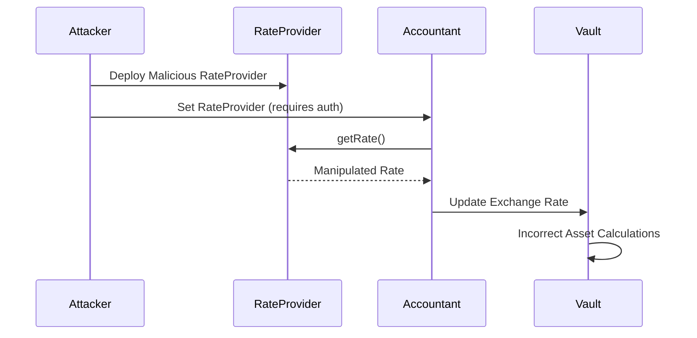

**Why False Positive:**
1. Rate providers require authorization through `setRateProviderData`
2. Rate changes are bounded by `allowedExchangeRateChangeUpper` and `allowedExchangeRateChangeLower`
3. Rate updates have minimum delay requirements
4. Contract uses safe math operations
5. Rate changes are monitored and validated

### 2. Cross-Chain Rate Manipulation (FALSE POSITIVE)

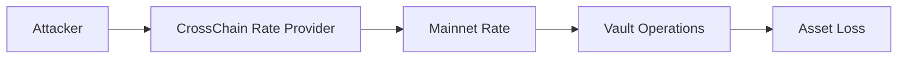

**Why False Positive:**
1. Cross-chain rates use same bounded mechanisms
2. Rate providers must implement `IRateProvider` interface
3. Rate changes are monitored and bounded
4. Safe math operations prevent overflow
5. Authorization required for rate provider changes

### 3. Merkle Verification Bypass (FALSE POSITIVE)

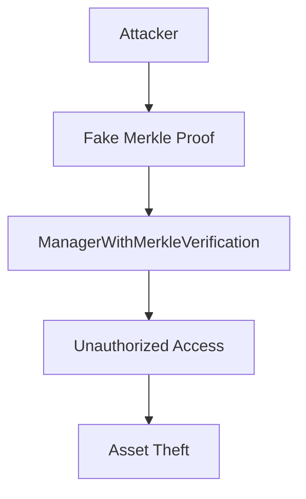

**Why False Positive:**
1. Merkle proofs are cryptographically secure
2. Each strategist has unique merkle root
3. Contract verifies both proof and call data
4. Flash loan operations protected by intent hashes
5. Authorization required for all operations

### 4. Delayed Withdraw Exploit (FALSE POSITIVE)

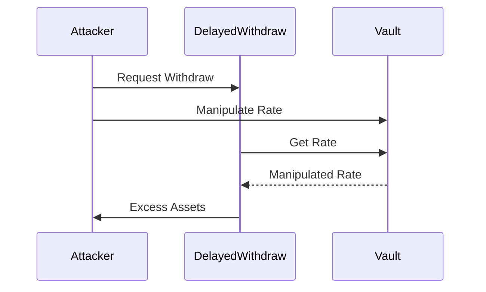

**Why False Positive:**
1. Withdrawals have strict delay requirements
2. Rate changes are bounded
3. Contract uses safe math operations
4. Withdrawals have maximum loss limits
5. Third-party completion requires explicit permission

### 5. Teller Asset Manipulation (FALSE POSITIVE)

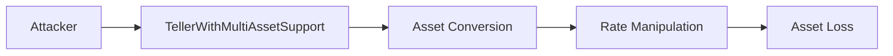
