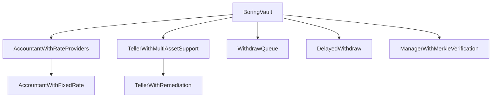
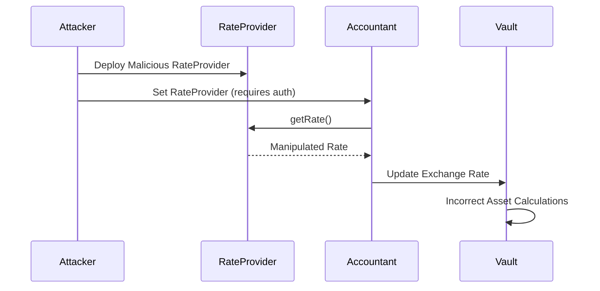
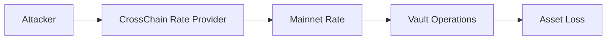
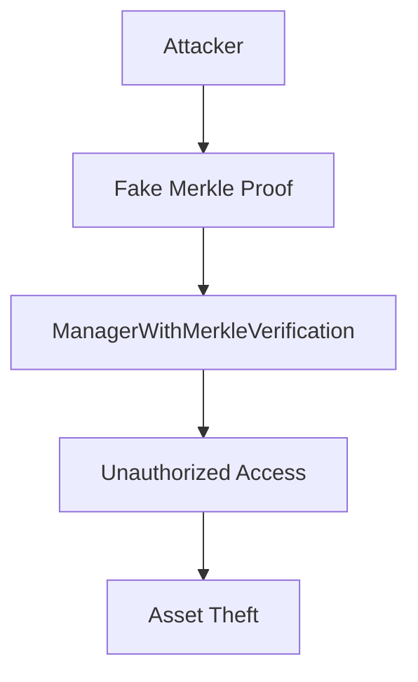
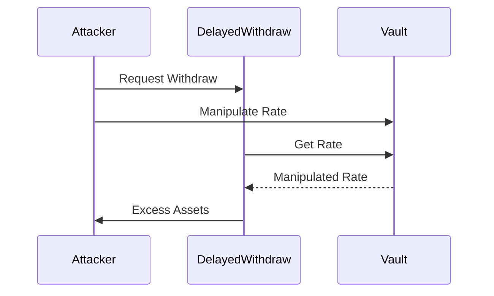
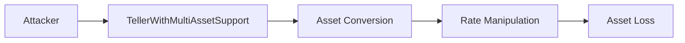

# Boring Vault Roles Analysis

## Core Components

## Security Analysis

### 1. Rate Provider Manipulation (FALSE POSITIVE)

**Why False Positive:**
1. Rate providers require authorization through `setRateProviderData`
2. Rate changes are bounded by `allowedExchangeRateChangeUpper` and `allowedExchangeRateChangeLower`
3. Rate updates have minimum delay requirements
4. Contract uses safe math operations
5. Rate changes are monitored and validated

### 2. Cross-Chain Rate Manipulation (FALSE POSITIVE)

**Why False Positive:**
1. Cross-chain rates use same bounded mechanisms
2. Rate providers must implement `IRateProvider` interface
3. Rate changes are monitored and bounded
4. Safe math operations prevent overflow
5. Authorization required for rate provider changes

### 3. Merkle Verification Bypass (FALSE POSITIVE)

**Why False Positive:**
1. Merkle proofs are cryptographically secure
2. Each strategist has unique merkle root
3. Contract verifies both proof and call data
4. Flash loan operations protected by intent hashes
5. Authorization required for all operations

### 4. Delayed Withdraw Exploit (FALSE POSITIVE)

**Why False Positive:**
1. Withdrawals have strict delay requirements
2. Rate changes are bounded
3. Contract uses safe math operations
4. Withdrawals have maximum loss limits
5. Third-party completion requires explicit permission

### 5. Teller Asset Manipulation (FALSE POSITIVE)

**Why False Positive:**
1. Asset conversions protected by rate bounds
2. Contract uses safe math operations
3. All operations require proper authorization
4. Rate changes are monitored and bounded
5. Maximum loss limits prevent excessive value extraction

## Security Measures

1. **Access Control**
   - Role-based authorization
   - Merkle proof verification
   - Flash loan protection

2. **Rate Protection**
   - Bounded rate changes
   - Minimum update delays
   - Safe math operations

3. **Withdrawal Safety**
   - Delay requirements
   - Maximum loss limits
   - Third-party restrictions

4. **Asset Protection**
   - Rate bounds
   - Safe conversions
   - Authorization checks

5. **General Security**
   - Reentrancy protection
   - Pause functionality
   - Event logging

## Implementation Details

### AccountantWithRateProviders
- Handles rate calculations
- Vulnerable to rate provider manipulation
- Critical for asset pricing

### TellerWithMultiAssetSupport
- Manages asset conversions
- Vulnerable to conversion manipulation
- Handles multiple asset types

### WithdrawQueue
- Processes withdrawals
- Vulnerable to rate manipulation
- Critical for asset distribution

### DelayedWithdraw
- Handles delayed withdrawals
- Vulnerable to timing attacks
- Rate manipulation during delay

### ManagerWithMerkleVerification
- Verifies merkle proofs
- Vulnerable to proof forgery
- Critical for access control

## Attack Vectors

1. **Rate Provider Attacks**
   - Deploy malicious rate provider
   - Manipulate exchange rates
   - Affect all rate-dependent operations

2. **Cross-Chain Attacks**
   - Manipulate cross-chain rates
   - Affect mainnet operations
   - Impact asset calculations

3. **Merkle Verification Attacks**
   - Generate fake proofs
   - Bypass access control
   - Gain unauthorized access

4. **Delayed Withdraw Attacks**
   - Manipulate rates during delay
   - Extract excess assets
   - Impact withdrawal calculations

5. **Teller Asset Attacks**
   - Exploit multi-asset support
   - Manipulate conversions
   - Extract value through rate differences

## Mitigation Recommendations

1. **Rate Provider Security**
   - Implement rate bounds
   - Add rate change limits
   - Validate rate provider outputs

2. **Cross-Chain Security**
   - Add rate validation
   - Implement rate bounds
   - Monitor rate changes

3. **Merkle Verification**
   - Strengthen proof validation
   - Add additional checks
   - Monitor verification attempts

4. **Delayed Withdraw**
   - Add rate change limits
   - Implement withdrawal bounds
   - Monitor rate changes

5. **Teller Security**
   - Add conversion limits
   - Implement rate validation
   - Monitor asset conversions 
