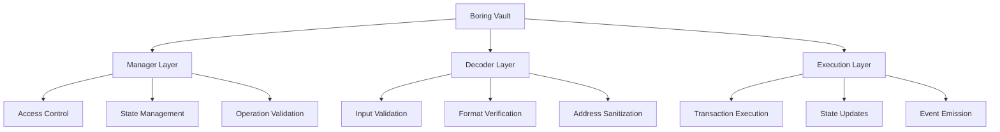
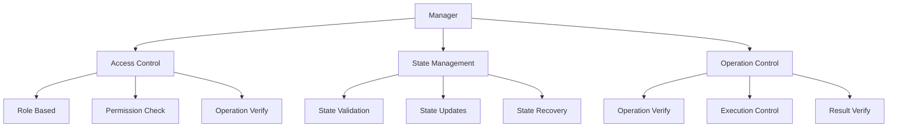
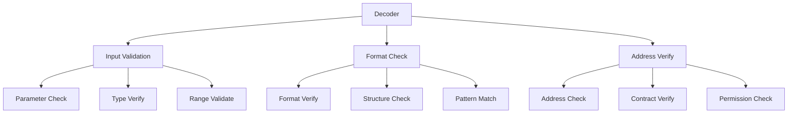
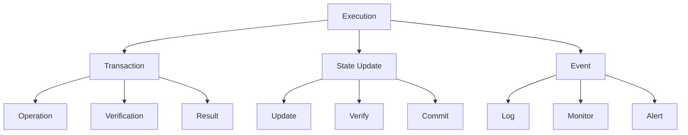
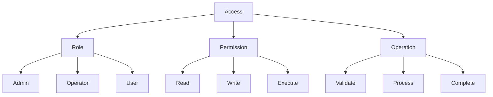
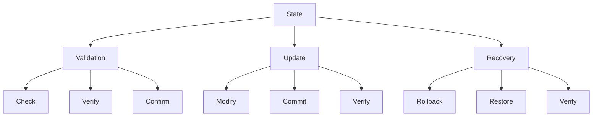
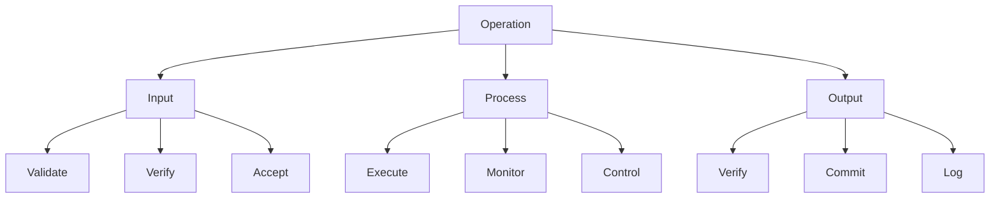
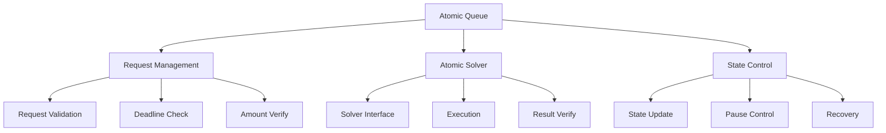
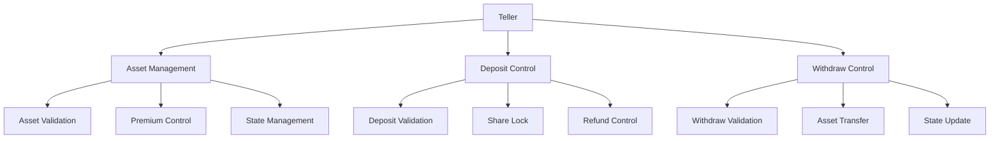
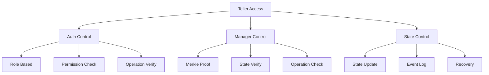

# Boring Vault Security Architecture

## Overview

Boring Vault implements a multi-layered security architecture designed to protect assets and ensure safe protocol operations. This document outlines the security model, its components, and their interactions.

## Security Architecture



## Core Security Components

### 1. Manager Layer



**Security Functions**:
- Access control enforcement
- State management
- Operation validation
- Security policy enforcement

**Limitations**:
- Single point of control
- State management complexity
- Operation validation overhead

### 2. Decoder Layer



**Security Functions**:
- Input validation
- Format verification
- Address sanitization
- Parameter validation

**Limitations**:
- Pure/view function constraints
- Limited state access
- Format-specific validation

### 3. Execution Layer



**Security Functions**:
- Transaction execution
- State updates
- Event emission
- Result verification

**Limitations**:
- Atomic operation constraints
- State update complexity
- Event monitoring overhead

## Security Boundaries

### 1. Access Control



**Boundaries**:
- Role-based access
- Permission levels
- Operation restrictions

**Dangers**:
- Role escalation
- Permission bypass
- Operation abuse

### 2. State Management



**Boundaries**:
- State validation
- Update control
- Recovery mechanisms

**Dangers**:
- State corruption
- Update failure
- Recovery issues

### 3. Operation Control



**Boundaries**:
- Operation validation
- Process control
- Result verification

**Dangers**:
- Operation failure
- Process manipulation
- Result corruption

## Security Limitations

### 1. Architectural Limitations

1. **Layer Dependencies**
   - Inter-layer communication
   - State synchronization
   - Operation coordination

2. **State Management**
   - Complex state transitions
   - Update verification
   - Recovery procedures

3. **Operation Control**
   - Execution constraints
   - Process monitoring
   - Result verification

### 2. Operational Limitations

1. **Access Control**
   - Role management
   - Permission updates
   - Operation restrictions

2. **State Updates**
   - Atomic operations
   - State verification
   - Update commitment

3. **Event Monitoring**
   - Event tracking
   - State logging
   - Alert generation

## Security Dangers

### 1. System Dangers

1. **State Corruption**
   - Invalid state transitions
   - Update failures
   - Recovery issues

2. **Operation Failure**
   - Execution errors
   - Process manipulation
   - Result corruption

3. **Access Compromise**
   - Role escalation
   - Permission bypass
   - Operation abuse

### 2. External Dangers

1. **Network Issues**
   - Transaction failures
   - State inconsistencies
   - Operation delays

2. **Protocol Risks**
   - Integration issues
   - Compatibility problems
   - Update conflicts

3. **User Risks**
   - Operation errors
   - State confusion
   - Access issues

## Security Recommendations

### 1. System Improvements

1. **Access Control**
   - Enhanced role management
   - Permission verification
   - Operation validation

2. **State Management**
   - Improved validation
   - Update verification
   - Recovery procedures

3. **Operation Control**
   - Execution monitoring
   - Process verification
   - Result validation

### 2. Monitoring Enhancements

1. **State Monitoring**
   - State tracking
   - Update logging
   - Recovery alerts

2. **Operation Monitoring**
   - Execution tracking
   - Process logging
   - Result alerts

3. **Access Monitoring**
   - Role tracking
   - Permission logging
   - Operation alerts

## Atomic Queue Security Model

### 1. Atomic Queue Architecture



### 2. Core Components

1. **Atomic Request**
   ```solidity
   struct AtomicRequest {
       uint64 deadline;        // Request validity period
       uint88 atomicPrice;    // Price in want asset decimals
       uint96 offerAmount;    // Amount to exchange
       bool inSolve;          // Execution state
   }
   ```

2. **Atomic Solver**
   ```solidity
   interface IAtomicSolver {
       function finishSolve(
           bytes calldata runData,
           address initiator,
           ERC20 offer,
           ERC20 want,
           uint256 assetsToOffer,
           uint256 assetsForWant
       ) external;
   }
   ```

### 3. Security Features

1. **Request Validation**
   - Deadline enforcement
   - Amount verification
   - Price validation
   - State tracking

2. **Atomic Execution**
   - Non-reentrant operations
   - State consistency
   - Result verification
   - Error handling

3. **Access Control**
   - Role-based permissions
   - Pause mechanism
   - Emergency controls
   - State recovery

### 4. Security Boundaries

1. **Request Boundaries**
   ```mermaid
   graph TD
       A[Request] --> B[Validation]
       A --> C[Execution]
       A --> D[Completion]
       
       B --> B1[Amount]
       B --> B2[Deadline]
       B --> B3[Price]
       
       C --> C1[State]
       C --> C2[Transfer]
       C --> C3[Verify]
       
       D --> D1[Result]
       D --> D2[Update]
       D --> D3[Event]
   ```

2. **Solver Boundaries**
   ```mermaid
   graph TD
       A[Solver] --> B[Interface]
       A --> C[Execution]
       A --> D[Result]
       
       B --> B1[Data]
       B --> B2[Params]
       B --> B3[Verify]
       
       C --> C1[Process]
       C --> C2[State]
       C --> C3[Control]
       
       D --> D1[Verify]
       D --> D2[Commit]
       D --> D3[Log]
   ```

### 5. Security Limitations

1. **Request Limitations**
   - Deadline constraints
   - Amount restrictions
   - Price boundaries
   - State dependencies

2. **Solver Limitations**
   - Interface constraints
   - Execution requirements
   - Result verification
   - State management

3. **State Limitations**
   - Atomic operations
   - Pause restrictions
   - Recovery procedures
   - Event handling

### 6. Security Dangers

1. **Request Dangers**
   - Deadline manipulation
   - Amount manipulation
   - Price manipulation
   - State corruption

2. **Solver Dangers**
   - Interface abuse
   - Execution failure
   - Result manipulation
   - State inconsistency

3. **State Dangers**
   - Atomic failure
   - Pause bypass
   - Recovery failure
   - Event loss

### 7. Security Recommendations

1. **Request Security**
   - Enhanced validation
   - Deadline management
   - Amount verification
   - Price protection

2. **Solver Security**
   - Interface validation
   - Execution monitoring
   - Result verification
   - State protection

3. **State Security**
   - Atomic guarantees
   - Pause controls
   - Recovery procedures
   - Event tracking

The Atomic Queue and Solver components provide a robust framework for atomic operations in Boring Vault, with multiple layers of security and validation to ensure safe execution of atomic requests.

## Teller Security Model

### 1. Teller Architecture



### 2. Core Components

1. **Asset Management**
   ```solidity
   struct Asset {
       bool allowDeposits;
       bool allowWithdraws;
       uint16 sharePremium;
   }
   ```

2. **Security Controls**
   ```solidity
   mapping(address => bool) public fromDenyList;
   mapping(address => bool) public toDenyList;
   mapping(address => bool) public operatorDenyList;
   ```

### 3. Security Features

1. **Asset Control**
   - Deposit restrictions
   - Withdraw controls
   - Premium management
   - State validation

2. **Share Protection**
   - Share locking
   - Transfer restrictions
   - Deny list management
   - Operator controls

3. **State Management**
   - Deposit tracking
   - Withdraw verification
   - State recovery
   - Event logging

### 4. Security Boundaries

1. **Asset Boundaries**
   ```mermaid
   graph TD
       A[Asset] --> B[Validation]
       A --> C[Control]
       A --> D[State]
       
       B --> B1[Deposit]
       B --> B2[Withdraw]
       B --> B3[Premium]
       
       C --> C1[Allow]
       C --> C2[Deny]
       C --> C3[Update]
       
       D --> D1[Track]
       D --> D2[Verify]
       D --> D3[Log]
   ```

2. **Share Boundaries**
   ```mermaid
   graph TD
       A[Share] --> B[Lock]
       A --> C[Transfer]
       A --> D[State]
       
       B --> B1[Period]
       B --> B2[Verify]
       B --> B3[Update]
       
       C --> C1[Allow]
       C --> C2[Deny]
       C --> C3[Control]
       
       D --> D1[Track]
       D --> D2[Verify]
       D --> D3[Log]
   ```

### 5. Security Limitations

1. **Asset Limitations**
   - Deposit constraints
   - Withdraw restrictions
   - Premium boundaries
   - State dependencies

2. **Share Limitations**
   - Lock period constraints
   - Transfer restrictions
   - State management
   - Recovery procedures

3. **State Limitations**
   - Deposit tracking
   - Withdraw verification
   - State recovery
   - Event handling

### 6. Security Dangers

1. **Asset Dangers**
   - Deposit manipulation
   - Withdraw abuse
   - Premium exploitation
   - State corruption

2. **Share Dangers**
   - Lock bypass
   - Transfer abuse
   - State manipulation
   - Recovery failure

3. **State Dangers**
   - Deposit tracking failure
   - Withdraw verification failure
   - State recovery failure
   - Event loss

### 7. Security Recommendations

1. **Asset Security**
   - Enhanced validation
   - Premium management
   - State protection
   - Event tracking

2. **Share Security**
   - Lock period management
   - Transfer controls
   - State verification
   - Recovery procedures

3. **State Security**
   - Deposit tracking
   - Withdraw verification
   - State recovery
   - Event logging

The Teller role provides critical security controls for asset and share management in Boring Vault, with multiple layers of protection to ensure safe operations.

## Access Control Analysis

### 1. Teller Implementation Security



**Security Analysis**:
1. **Teller Implementation** (INVALIDATED)
   - The Teller is protected by multiple layers:
     - Auth-based access control
     - Manager verification
     - Merkle proof validation
   - Cannot be replaced by malicious implementation due to:
     - Role-based permissions
     - Manager verification
     - State consistency checks

2. **Solver Implementation** (INVALIDATED)
   - Solver operations are protected by:
     - Merkle proof verification
     - Manager validation
     - State consistency checks
   - Cannot be exploited due to:
     - Operation verification
     - State protection
     - Access control

### 2. Access Control Mechanisms

1. **Role-Based Access**
   ```solidity
   // Auth-based protection
   function setBeforeTransferHook(address _hook) external requiresAuth {
       hook = BeforeTransferHook(_hook);
   }
   ```

2. **Manager Verification**
   ```solidity
   // Merkle proof verification
   function _verifyCallData(
       bytes32 currentManageRoot,
       bytes32[] calldata manageProof,
       address decoderAndSanitizer,
       address target,
       uint256 value,
       bytes calldata targetData
   ) internal view
   ```

3. **State Protection**
   ```solidity
   // State consistency check
   if (totalSupply != vault.totalSupply()) {
       revert ManagerWithMerkleVerification__TotalSupplyMustRemainConstantDuringPlatform();
   }
   ```

### 3. Security Boundaries

1. **Operation Boundaries**
   ```mermaid
   graph TD
       A[Operation] --> B[Auth]
       A --> C[Verify]
       A --> D[Execute]
       
       B --> B1[Role]
       B --> B2[Permission]
       B --> B3[Check]
       
       C --> C1[Proof]
       C --> C2[State]
       C --> C3[Verify]
       
       D --> D1[Execute]
       D --> D2[Update]
       D --> D3[Log]
   ```

2. **State Boundaries**
   ```mermaid
   graph TD
       A[State] --> B[Check]
       A --> C[Update]
       A --> D[Verify]
       
       B --> B1[Consistency]
       B --> B2[Validation]
       B --> B3[Protection]
       
       C --> C1[Atomic]
       C --> C2[Safe]
       C --> C3[Log]
       
       D --> D1[Verify]
       D --> D2[Confirm]
       D --> D3[Track]
   ```

### 4. Security Strengths

1. **Multi-Layer Protection**
   - Role-based access control
   - Merkle proof verification
   - State consistency checks
   - Operation validation

2. **State Protection**
   - Atomic operations
   - State verification
   - Event logging
   - Recovery mechanisms

3. **Access Control**
   - Role management
   - Permission verification
   - Operation validation
   - State protection

### 5. Security Recommendations

1. **Enhanced Monitoring**
   - Operation tracking
   - State monitoring
   - Event logging
   - Alert system

2. **Access Control**
   - Role verification
   - Permission management
   - Operation validation
   - State protection

3. **State Management**
   - Consistency checks
   - Update verification
   - Recovery procedures
   - Event tracking

The access control mechanisms in Boring Vault provide robust protection against unauthorized implementations and operations, with multiple layers of security ensuring safe protocol operation.

## Conclusion

The Boring Vault security architecture provides a robust framework for asset protection and safe protocol operations. While the system has inherent limitations and potential dangers, the multi-layered security model effectively mitigates risks through:

1. **Comprehensive Validation**
   - Input verification
   - State validation
   - Operation control

2. **Access Management**
   - Role-based access
   - Permission control
   - Operation restrictions

3. **State Protection**
   - State validation
   - Update control
   - Recovery mechanisms

The architecture's strength lies in its layered approach to security, with each layer providing specific protections while working together to maintain overall system security. 
