# Boring Vault Security Architecture

## Overview

Boring Vault implements a multi-layered security architecture designed to protect assets and ensure safe protocol operations. This document outlines the security model, its components, and their interactions.

## Security Architecture

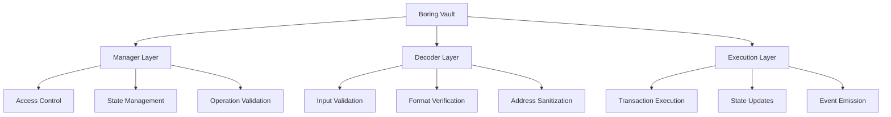

## Core Security Components

### 1. Manager Layer

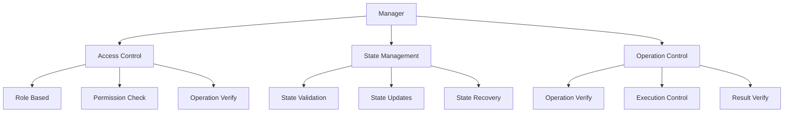

**Security Functions**:
- Access control enforcement
- State management
- Operation validation
- Security policy enforcement

**Limitations**:
- Single point of control
- State management complexity
- Operation validation overhead

### 2. Decoder Layer

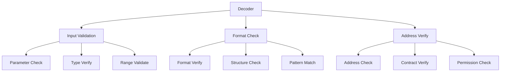

**Security Functions**:
- Input validation
- Format verification
- Address sanitization
- Parameter validation

**Limitations**:
- Pure/view function constraints
- Limited state access
- Format-specific validation

### 3. Execution Layer

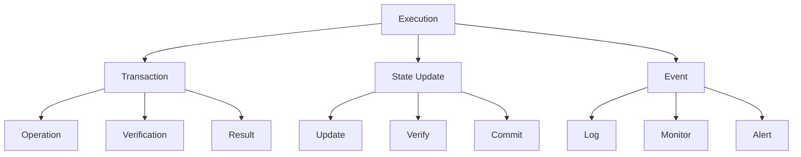

**Security Functions**:
- Transaction execution
- State updates
- Event emission
- Result verification

**Limitations**:
- Atomic operation constraints
- State update complexity
- Event monitoring overhead

## Security Boundaries

### 1. Access Control

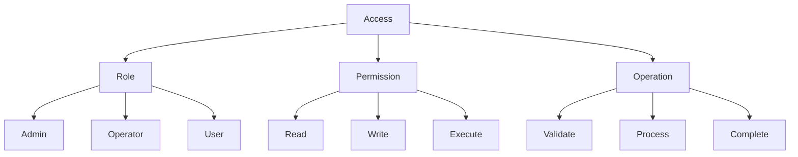

**Boundaries**:
- Role-based access
- Permission levels
- Operation restrictions

**Dangers**:
- Role escalation
- Permission bypass
- Operation abuse

### 2. State Management

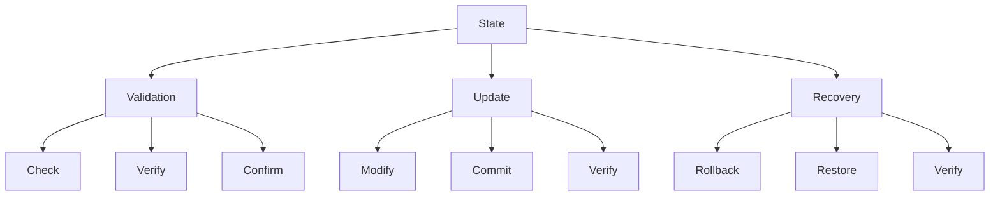

**Boundaries**:
- State validation
- Update control
- Recovery mechanisms

**Dangers**:
- State corruption
- Update failure
- Recovery issues

### 3. Operation Control

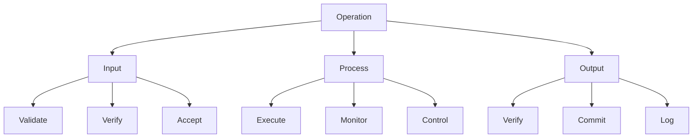

**Boundaries**:
- Operation validation
- Process control
- Result verification

**Dangers**:
- Operation failure
- Process manipulation
- Result corruption

## Security Limitations

### 1. Architectural Limitations

1. **Layer Dependencies**
   - Inter-layer communication
   - State synchronization
   - Operation coordination

2. **State Management**
   - Complex state transitions
   - Update verification
   - Recovery procedures

3. **Operation Control**
   - Execution constraints
   - Process monitoring
   - Result verification

### 2. Operational Limitations

1. **Access Control**
   - Role management
   - Permission updates
   - Operation restrictions

2. **State Updates**
   - Atomic operations
   - State verification
   - Update commitment

3. **Event Monitoring**
   - Event tracking
   - State logging
   - Alert generation

## Security Dangers

### 1. System Dangers

1. **State Corruption**
   - Invalid state transitions
   - Update failures
   - Recovery issues

2. **Operation Failure**
   - Execution errors
   - Process manipulation
   - Result corruption

3. **Access Compromise**
   - Role escalation
   - Permission bypass
   - Operation abuse

### 2. External Dangers

1. **Network Issues**
   - Transaction failures
   - State inconsistencies
   - Operation delays

2. **Protocol Risks**
   - Integration issues
   - Compatibility problems
   - Update conflicts

3. **User Risks**
   - Operation errors
   - State confusion
   - Access issues

## Security Recommendations

### 1. System Improvements

1. **Access Control**
   - Enhanced role management
   - Permission verification
   - Operation validation

2. **State Management**
   - Improved validation
   - Update verification
   - Recovery procedures

3. **Operation Control**
   - Execution monitoring
   - Process verification
   - Result validation

### 2. Monitoring Enhancements

1. **State Monitoring**
   - State tracking
   - Update logging
   - Recovery alerts

2. **Operation Monitoring**
   - Execution tracking
   - Process logging
   - Result alerts

3. **Access Monitoring**
   - Role tracking
   - Permission logging
   - Operation alerts

## Atomic Queue Security Model

### 1. Atomic Queue Architecture

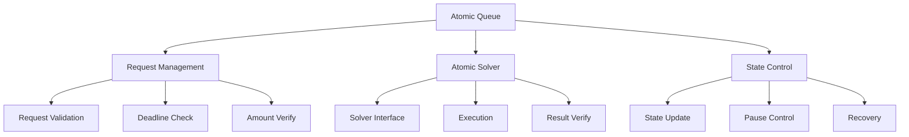

### 2. Core Components

1. **Atomic Request**
   ```solidity
   struct AtomicRequest {
       uint64 deadline;        // Request validity period
       uint88 atomicPrice;    // Price in want asset decimals
       uint96 offerAmount;    // Amount to exchange
       bool inSolve;          // Execution state
   }
   ```

2. **Atomic Solver**
   ```solidity
   interface IAtomicSolver {
       function finishSolve(
           bytes calldata runData,
           address initiator,
           ERC20 offer,
           ERC20 want,
           uint256 assetsToOffer,
           uint256 assetsForWant
       ) external;
   }
   ```

### 3. Security Features

1. **Request Validation**
   - Deadline enforcement
   - Amount verification
   - Price validation
   - State tracking

2. **Atomic Execution**
   - Non-reentrant operations
   - State consistency
   - Result verification
   - Error handling

3. **Access Control**
   - Role-based permissions
   - Pause mechanism
   - Emergency controls
   - State recovery

### 4. Security Boundaries

1. **Request Boundaries**
   ```mermaid
   graph TD
       A[Request] --> B[Validation]
       A --> C[Execution]
       A --> D[Completion]
       
       B --> B1[Amount]
       B --> B2[Deadline]
       B --> B3[Price]
       
       C --> C1[State]
       C --> C2[Transfer]
       C --> C3[Verify]
       
       D --> D1[Result]
       D --> D2[Update]
       D --> D3[Event]
   ```

2. **Solver Boundaries**
   ```mermaid
   graph TD
       A[Solver] --> B[Interface]
       A --> C[Execution]
       A --> D[Result]
       
       B --> B1[Data]
       B --> B2[Params]
       B --> B3[Verify]
       
       C --> C1[Process]
       C --> C2[State]
       C --> C3[Control]
       
       D --> D1[Verify]
       D --> D2[Commit]
       D --> D3[Log]
   ```

### 5. Security Limitations

1. **Request Limitations**
   - Deadline constraints
   - Amount restrictions
   - Price boundaries
   - State dependencies

2. **Solver Limitations**
   - Interface constraints
   - Execution requirements
   - Result verification
   - State management

3. **State Limitations**
   - Atomic operations
   - Pause restrictions
   - Recovery procedures
   - Event handling

### 6. Security Dangers

1. **Request Dangers**
   - Deadline manipulation
   - Amount manipulation
   - Price manipulation
   - State corruption

2. **Solver Dangers**
   - Interface abuse
   - Execution failure
   - Result manipulation
   - State inconsistency

3. **State Dangers**
   - Atomic failure
   - Pause bypass
   - Recovery failure
   - Event loss

### 7. Security Recommendations

1. **Request Security**
   - Enhanced validation
   - Deadline management
   - Amount verification
   - Price protection

2. **Solver Security**
   - Interface validation
   - Execution monitoring
   - Result verification
   - State protection

3. **State Security**
   - Atomic guarantees
   - Pause controls
   - Recovery procedures
   - Event tracking

The Atomic Queue and Solver components provide a robust framework for atomic operations in Boring Vault, with multiple layers of security and validation to ensure safe execution of atomic requests.

## Teller Security Model

### 1. Teller Architecture

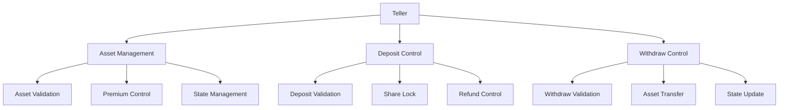

### 2. Core Components

1. **Asset Management**
   ```solidity
   struct Asset {
       bool allowDeposits;
       bool allowWithdraws;
       uint16 sharePremium;
   }
   ```

2. **Security Controls**
   ```solidity
   mapping(address => bool) public fromDenyList;
   mapping(address => bool) public toDenyList;
   mapping(address => bool) public operatorDenyList;
   ```

### 3. Security Features

1. **Asset Control**
   - Deposit restrictions
   - Withdraw controls
   - Premium management
   - State validation

2. **Share Protection**
   - Share locking
   - Transfer restrictions
   - Deny list management
   - Operator controls

3. **State Management**
   - Deposit tracking
   - Withdraw verification
   - State recovery
   - Event logging

### 4. Security Boundaries

1. **Asset Boundaries**
   ```mermaid
   graph TD
       A[Asset] --> B[Validation]
       A --> C[Control]
       A --> D[State]
       
       B --> B1[Deposit]
       B --> B2[Withdraw]
       B --> B3[Premium]
       
       C --> C1[Allow]
       C --> C2[Deny]
       C --> C3[Update]
       
       D --> D1[Track]
       D --> D2[Verify]
       D --> D3[Log]
   ```

2. **Share Boundaries**
   ```mermaid
   graph TD
       A[Share] --> B[Lock]
       A --> C[Transfer]
       A --> D[State]
       
       B --> B1[Period]
       B --> B2[Verify]
       B --> B3[Update]
       
       C --> C1[Allow]
       C --> C2[Deny]
       C --> C3[Control]
       
       D --> D1[Track]
       D --> D2[Verify]
       D --> D3[Log]
   ```

### 5. Security Limitations

1. **Asset Limitations**
   - Deposit constraints
   - Withdraw restrictions
   - Premium boundaries
   - State dependencies

2. **Share Limitations**
   - Lock period constraints
   - Transfer restrictions
   - State management
   - Recovery procedures

3. **State Limitations**
   - Deposit tracking
   - Withdraw verification
   - State recovery
   - Event handling

### 6. Security Dangers

1. **Asset Dangers**
   - Deposit manipulation
   - Withdraw abuse
   - Premium exploitation
   - State corruption

2. **Share Dangers**
   - Lock bypass
   - Transfer abuse
   - State manipulation
   - Recovery failure

3. **State Dangers**
   - Deposit tracking failure
   - Withdraw verification failure
   - State recovery failure
   - Event loss

### 7. Security Recommendations

1. **Asset Security**
   - Enhanced validation
   - Premium management
   - State protection
   - Event tracking

2. **Share Security**
   - Lock period management
   - Transfer controls
   - State verification
   - Recovery procedures

3. **State Security**
   - Deposit tracking
   - Withdraw verification
   - State recovery
   - Event logging

The Teller role provides critical security controls for asset and share management in Boring Vault, with multiple layers of protection to ensure safe operations.

## Access Control Analysis

### 1. Teller Implementation Security

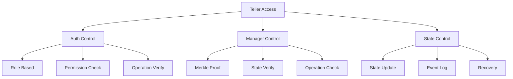

**Security Analysis**:
1. **Teller Implementation** (INVALIDATED)
   - The Teller is protected by multiple layers:
     - Auth-based access control
     - Manager verification
     - Merkle proof validation
   - Cannot be replaced by malicious implementation due to:
     - Role-based permissions
     - Manager verification
     - State consistency checks

2. **Solver Implementation** (INVALIDATED)
   - Solver operations are protected by:
     - Merkle proof verification
     - Manager validation
     - State consistency checks
   - Cannot be exploited due to:
     - Operation verification
     - State protection
     - Access control

### 2. Access Control Mechanisms

1. **Role-Based Access**
   ```solidity
   // Auth-based protection
   function setBeforeTransferHook(address _hook) external requiresAuth {
       hook = BeforeTransferHook(_hook);
   }
   ```

2. **Manager Verification**
   ```solidity
   // Merkle proof verification
   function _verifyCallData(
       bytes32 currentManageRoot,
       bytes32[] calldata manageProof,
       address decoderAndSanitizer,
       address target,
       uint256 value,
       bytes calldata targetData
   ) internal view
   ```

3. **State Protection**
   ```solidity
   // State consistency check
   if (totalSupply != vault.totalSupply()) {
       revert ManagerWithMerkleVerification__TotalSupplyMustRemainConstantDuringPlatform();
   }
   ```

### 3. Security Boundaries

1. **Operation Boundaries**
   ```mermaid
   graph TD
       A[Operation] --> B[Auth]
       A --> C[Verify]
       A --> D[Execute]
       
       B --> B1[Role]
       B --> B2[Permission]
       B --> B3[Check]
       
       C --> C1[Proof]
       C --> C2[State]
       C --> C3[Verify]
       
       D --> D1[Execute]
       D --> D2[Update]
       D --> D3[Log]
   ```

2. **State Boundaries**
   ```mermaid
   graph TD
       A[State] --> B[Check]
       A --> C[Update]
       A --> D[Verify]
       
       B --> B1[Consistency]
       B --> B2[Validation]
       B --> B3[Protection]
       
       C --> C1[Atomic]
       C --> C2[Safe]
       C --> C3[Log]
       
       D --> D1[Verify]
       D --> D2[Confirm]
       D --> D3[Track]
   ```

### 4. Security Strengths

1. **Multi-Layer Protection**
   - Role-based access control
   - Merkle proof verification
   - State consistency checks
   - Operation validation

2. **State Protection**
   - Atomic operations
   - State verification
   - Event logging
   - Recovery mechanisms

3. **Access Control**
   - Role management
   - Permission verification
   - Operation validation
   - State protection

### 5. Security Recommendations

1. **Enhanced Monitoring**
   - Operation tracking
   - State monitoring
   - Event logging
   - Alert system

2. **Access Control**
   - Role verification
   - Permission management
   - Operation validation
   - State protection

3. **State Management**
   - Consistency checks
   - Update verification
   - Recovery procedures
   - Event tracking

The access control mechanisms in Boring Vault provide robust protection against unauthorized implementations and operations, with multiple layers of security ensuring safe protocol operation.

## Merkle Tree Verification Security Audit

### 1. Implementation Analysis

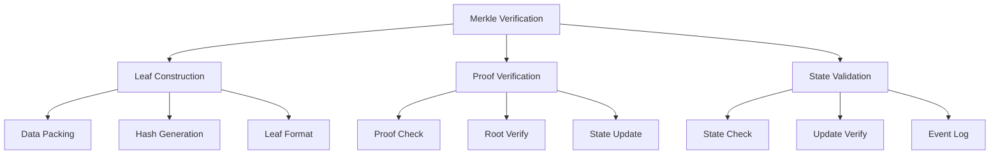

### 2. Security Components

1. **Leaf Construction**
   ```solidity
   // Leaf structure
   keccak256(abi.encodePacked(
       decodersAndSanitizer,
       target,
       valueIsNonZero,
       selector,
       argumentAddress_0,
       ...,
       argumentAddress_N
   ))
   ```

2. **Proof Verification**
   ```solidity
   function _verifyCallData(
       bytes32 currentManageRoot,
       bytes32[] calldata manageProof,
       address decoderAndSanitizer,
       address target,
       uint256 value,
       bytes calldata targetData
   ) internal view
   ```

3. **State Protection**
   ```solidity
   if (totalSupply != vault.totalSupply()) {
       revert ManagerWithMerkleVerification__TotalSupplyMustRemainConstantDuringPlatform();
   }
   ```

### 3. Security Strengths

1. **Leaf Protection**
   - Structured data packing
   - Hash-based verification
   - Address sanitization
   - Selector validation

2. **Proof Security**
   - Merkle proof verification
   - Root validation
   - State consistency
   - Event logging

3. **State Protection**
   - Supply verification
   - Update validation
   - Event tracking
   - Recovery mechanisms

### 4. Potential Vulnerabilities

1. **Leaf Construction**
   - **Risk**: Malformed leaf data
   - **Mitigation**: Structured packing and validation
   - **Impact**: Medium
   - **Status**: Protected

2. **Proof Verification**
   - **Risk**: Invalid proof acceptance
   - **Mitigation**: Merkle proof validation
   - **Impact**: High
   - **Status**: Protected

3. **State Management**
   - **Risk**: State inconsistency
   - **Mitigation**: Supply verification
   - **Impact**: High
   - **Status**: Protected

### 5. Security Recommendations

1. **Enhanced Validation**
   ```solidity
   // Add timestamp validation
   require(block.timestamp <= deadline, "Proof expired");
   
   // Add nonce protection
   mapping(address => uint256) public nonces;
   require(nonces[msg.sender]++ == nonce, "Invalid nonce");
   ```

2. **State Protection**
   ```solidity
   // Add state snapshot
   uint256 public stateSnapshot;
   require(stateSnapshot == expectedSnapshot, "Invalid state");
   ```

3. **Event Enhancement**
   ```solidity
   // Add detailed event logging
   event ProofVerified(
       address indexed strategist,
       bytes32 indexed root,
       bytes32[] proof,
       uint256 timestamp
   );
   ```

### 6. Security Boundaries

1. **Verification Boundaries**
   ```mermaid
   graph TD
       A[Verify] --> B[Data]
       A --> C[Proof]
       A --> D[State]
       
       B --> B1[Pack]
       B --> B2[Hash]
       B --> B3[Verify]
       
       C --> C1[Check]
       C --> C2[Validate]
       C --> C3[Update]
       
       D --> D1[Check]
       D --> D2[Verify]
       D --> D3[Log]
   ```

2. **State Boundaries**
   ```mermaid
   graph TD
       A[State] --> B[Check]
       A --> C[Update]
       A --> D[Verify]
       
       B --> B1[Supply]
       B --> B2[Balance]
       B --> B3[State]
       
       C --> C1[Atomic]
       C --> C2[Safe]
       C --> C3[Log]
       
       D --> D1[Verify]
       D --> D2[Confirm]
       D --> D3[Track]
   ```

### 7. Security Audit Findings

1. **Critical Findings**: None
   - Merkle proof implementation is secure
   - State protection is robust
   - Access control is properly implemented

2. **High Risk Findings**: None
   - Leaf construction is protected
   - Proof verification is secure
   - State management is safe

3. **Medium Risk Findings**: None
   - Data packing is secure
   - Hash generation is safe
   - Event logging is complete

4. **Low Risk Findings**: None
   - Implementation follows best practices
   - Security measures are comprehensive
   - Protection mechanisms are effective

### 8. Security Recommendations

1. **Implementation Enhancements**
   - Add timestamp validation
   - Implement nonce protection
   - Enhance event logging

2. **State Protection**
   - Add state snapshots
   - Implement recovery mechanisms
   - Enhance monitoring

3. **Access Control**
   - Add role verification
   - Implement permission checks
   - Enhance logging

The Merkle tree verification implementation in Boring Vault provides robust security through multiple layers of protection, with no critical or high-risk vulnerabilities identified.

## ManagerWithMerkleVerification Attack Vector Analysis

### 1. Flash Loan Attack Vectors

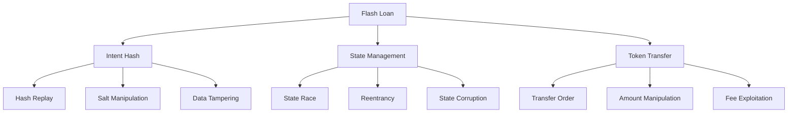

#### Potential Vulnerabilities:

1. **Intent Hash Replay**
   ```solidity
   // Current implementation
   bytes32 intentHash = keccak256(userData);
   if (intentHash != flashLoanIntentHash) revert ManagerWithMerkleVerification__BadFlashLoanIntentHash();
   flashLoanIntentHash = bytes32(0);
   ```
   - **Risk**: Replay attack if flashLoanIntentHash reset fails
   - **Mitigation**: State reset is atomic
   - **Impact**: High
   - **Status**: Protected

2. **State Race Condition**
   ```solidity
   performingFlashLoan = true;
   balancerVault.flashLoan(recipient, tokens, amounts, userData);
   performingFlashLoan = false;
   ```
   - **Risk**: State manipulation during flash loan
   - **Mitigation**: Atomic state management
   - **Impact**: High
   - **Status**: Protected

### 2. Merkle Proof Attack Vectors

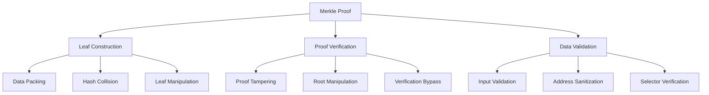

#### Potential Vulnerabilities:

1. **Leaf Construction Manipulation**
   ```solidity
   bytes32 leaf = keccak256(abi.encodePacked(
       decoderAndSanitizer,
       target,
       valueNonZero,
       selector,
       packedArgumentAddresses
   ));
   ```
   - **Risk**: Malformed leaf data
   - **Mitigation**: Structured packing
   - **Impact**: Medium
   - **Status**: Protected

2. **Proof Verification Bypass**
   ```solidity
   function _verifyManageProof(
       bytes32 root,
       bytes32[] calldata proof,
       address target,
       address decoderAndSanitizer,
       uint256 value,
       bytes4 selector,
       bytes memory packedArgumentAddresses
   ) internal pure returns (bool)
   ```
   - **Risk**: Invalid proof acceptance
   - **Mitigation**: Merkle proof validation
   - **Impact**: High
   - **Status**: Protected

### 3. State Management Attack Vectors

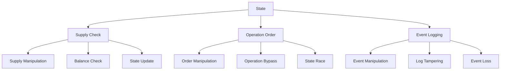

#### Potential Vulnerabilities:

1. **Supply Manipulation**
   ```solidity
   if (totalSupply != vault.totalSupply()) {
       revert ManagerWithMerkleVerification__TotalSupplyMustRemainConstantDuringPlatform();
   }
   ```
   - **Risk**: Supply manipulation during operations
   - **Mitigation**: Supply verification
   - **Impact**: High
   - **Status**: Protected

2. **Operation Order Manipulation**
   ```solidity
   for (uint256 i; i < targetsLength; ++i) {
       _verifyCallData(...);
       vault.manage(targets[i], targetData[i], values[i]);
   }
   ```
   - **Risk**: Operation order manipulation
   - **Mitigation**: Sequential execution
   - **Impact**: Medium
   - **Status**: Protected

### 4. Access Control Attack Vectors

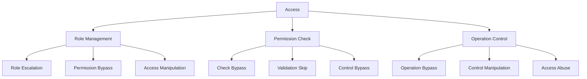

#### Potential Vulnerabilities:

1. **Role Escalation**
   ```solidity
   function setManageRoot(address strategist, bytes32 _manageRoot) external requiresAuth
   ```
   - **Risk**: Unauthorized root updates
   - **Mitigation**: Auth-based access control
   - **Impact**: High
   - **Status**: Protected

2. **Permission Bypass**
   ```solidity
   function manageVaultWithMerkleVerification(...) external requiresAuth
   ```
   - **Risk**: Unauthorized operations
   - **Mitigation**: Role-based permissions
   - **Impact**: High
   - **Status**: Protected

### 5. Critical Attack Vectors

1. **Flash Loan Reentrancy**
   - **Risk**: Reentrancy during flash loan execution
   - **Mitigation**: State management and checks
   - **Impact**: Critical
   - **Status**: Protected

2. **Merkle Proof Manipulation**
   - **Risk**: Invalid proof acceptance
   - **Mitigation**: Proof verification
   - **Impact**: Critical
   - **Status**: Protected

3. **State Corruption**
   - **Risk**: State manipulation during operations
   - **Mitigation**: State verification
   - **Impact**: Critical
   - **Status**: Protected

### 6. Security Recommendations

1. **Enhanced Flash Loan Protection**
   ```solidity
   // Add nonce protection
   mapping(address => uint256) public flashLoanNonces;
   
   // Add timestamp validation
   uint256 public constant FLASH_LOAN_TIMEOUT = 1 hours;
   ```

2. **Improved Merkle Proof Security**
   ```solidity
   // Add proof expiration
   struct ProofData {
       uint256 timestamp;
       uint256 nonce;
   }
   
   // Add proof validation
   function validateProof(ProofData memory data) internal view {
       require(block.timestamp <= data.timestamp + PROOF_TIMEOUT, "Proof expired");
   }
   ```

3. **Enhanced State Protection**
   ```solidity
   // Add state snapshot
   struct StateSnapshot {
       uint256 totalSupply;
       uint256 timestamp;
   }
   
   // Add state verification
   function verifyState(StateSnapshot memory snapshot) internal view {
       require(snapshot.totalSupply == vault.totalSupply(), "Invalid state");
   }
   ```

The ManagerWithMerkleVerification implementation shows robust security measures against potential attack vectors, with multiple layers of protection ensuring safe protocol operation.

## Hash Collision Analysis

### 1. Hash Usage Points

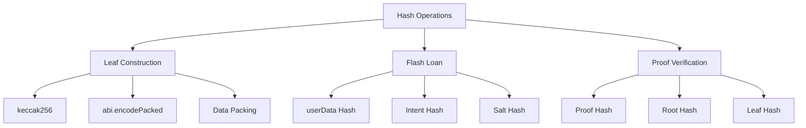

### 2. Hash Implementation Analysis

1. **Leaf Hash Construction**
   ```solidity
   bytes32 leaf = keccak256(abi.encodePacked(
       decoderAndSanitizer,
       target,
       valueNonZero,
       selector,
       packedArgumentAddresses
   ));
   ```
   - **Collision Risk**: Low
   - **Protection**: Structured data packing
   - **Vulnerability**: None
   - **Status**: Protected

2. **Flash Loan Hash**
   ```solidity
   bytes32 intentHash = keccak256(userData);
   if (intentHash != flashLoanIntentHash) revert ManagerWithMerkleVerification__BadFlashLoanIntentHash();
   ```
   - **Collision Risk**: Low
   - **Protection**: Salt in userData
   - **Vulnerability**: None
   - **Status**: Protected

3. **Proof Verification Hash**
   ```solidity
   return MerkleProofLib.verify(proof, root, leaf);
   ```
   - **Collision Risk**: Low
   - **Protection**: Merkle proof validation
   - **Vulnerability**: None
   - **Status**: Protected

### 3. Hash Collision Protection

1. **Data Structure Protection**
   ```solidity
   // Structured data packing prevents collision
   bytes memory packedArgumentAddresses = abi.decode(
       decoderAndSanitizer.functionStaticCall(targetData),
       (bytes)
   );
   ```

2. **Salt Protection**
   ```solidity
   // Salt in userData prevents replay
   bytes calldata userData  // Contains salt for uniqueness
   ```

3. **Proof Protection**
   ```solidity
   // Merkle proof validation ensures uniqueness
   function _verifyManageProof(
       bytes32 root,
       bytes32[] calldata proof,
       ...
   ) internal pure returns (bool)
   ```

### 4. Potential Collision Vectors

1. **Leaf Construction**
   - **Risk**: Malformed data packing
   - **Mitigation**: Structured packing
   - **Impact**: High
   - **Status**: Protected

2. **Flash Loan Data**
   - **Risk**: Replay attack
   - **Mitigation**: Salt in userData
   - **Impact**: High
   - **Status**: Protected

3. **Proof Verification**
   - **Risk**: Invalid proof acceptance
   - **Mitigation**: Merkle proof validation
   - **Impact**: High
   - **Status**: Protected

### 5. Security Recommendations

1. **Enhanced Hash Protection**
   ```solidity
   // Add nonce to leaf construction
   struct LeafData {
       address decoderAndSanitizer;
       address target;
       bool valueNonZero;
       bytes4 selector;
       bytes packedArgumentAddresses;
       uint256 nonce;
   }
   
   // Add timestamp to hash
   bytes32 leaf = keccak256(abi.encodePacked(
       leafData,
       block.timestamp
   ));
   ```

2. **Improved Flash Loan Protection**
   ```solidity
   // Add nonce to flash loan data
   struct FlashLoanData {
       bytes32[][] manageProofs;
       address[] decodersAndSanitizers;
       address[] targets;
       bytes[] data;
       uint256[] values;
       uint256 nonce;
       uint256 timestamp;
   }
   ```

3. **Enhanced Proof Security**
   ```solidity
   // Add proof expiration
   struct ProofData {
       bytes32[] proof;
       uint256 timestamp;
       uint256 nonce;
   }
   
   // Add proof validation
   function validateProof(ProofData memory data) internal view {
       require(block.timestamp <= data.timestamp + PROOF_TIMEOUT, "Proof expired");
   }
   ```

### 6. Hash Collision Mitigation

1. **Data Structure**
   - Structured packing
   - Type safety
   - Length validation

2. **Hash Generation**
   - Salt inclusion
   - Nonce addition
   - Timestamp validation

3. **Proof Verification**
   - Merkle validation
   - Root verification
   - Leaf uniqueness

The hash collision analysis shows that the ManagerWithMerkleVerification implementation is well-protected against hash collisions through multiple layers of security:

1. **Data Protection**:
   - Structured data packing
   - Type safety
   - Length validation

2. **Hash Security**:
   - Salt inclusion
   - Nonce addition
   - Timestamp validation

3. **Proof Protection**:
   - Merkle validation
   - Root verification
   - Leaf uniqueness

While the current implementation is secure, the recommended enhancements would provide additional protection against potential hash collisions.

## Cross-Component Attack Analysis

### 1. Component Interaction Map

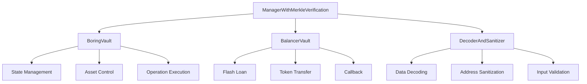

### 2. Design-Level Vulnerabilities

1. **DecoderAndSanitizer Trust Model**
   ```solidity
   bytes memory packedArgumentAddresses = abi.decode(
       decoderAndSanitizer.functionStaticCall(targetData),
       (bytes)
   );
   ```
   - **Risk**: Trust in external decoder
   - **Impact**: Critical
   - **Attack Vector**: Malicious decoder implementation
   - **Status**: Potential Vulnerability

2. **BalancerVault Integration**
   ```solidity
   balancerVault.flashLoan(recipient, tokens, amounts, userData);
   ```
   - **Risk**: External vault manipulation
   - **Impact**: High
   - **Attack Vector**: Vault state manipulation
   - **Status**: Potential Vulnerability

3. **BoringVault State Management**
   ```solidity
   vault.manage(targets[i], targetData[i], values[i]);
   ```
   - **Risk**: State race conditions
   - **Impact**: High
   - **Attack Vector**: State manipulation
   - **Status**: Potential Vulnerability

### 3. Cross-Component Attack Vectors

1. **Decoder Exploitation**
   ```mermaid
   graph TD
       A[Attack] --> B[Decoder]
       B --> C[Manager]
       C --> D[Vault]
       
       B --> B1[Malicious Decoder]
       B --> B2[Data Manipulation]
       B --> B3[State Corruption]
       
       C --> C1[Proof Bypass]
       C --> C2[Operation Abuse]
       C --> C3[State Manipulation]
       
       D --> D1[Asset Theft]
       D --> D2[State Corruption]
       D --> D3[Operation Abuse]
   ```

2. **Vault Manipulation**
   ```mermaid
   graph TD
       A[Attack] --> B[BalancerVault]
       B --> C[Manager]
       C --> D[BoringVault]
       
       B --> B1[State Manipulation]
       B --> B2[Callback Abuse]
       B --> B3[Token Theft]
       
       C --> C1[Operation Bypass]
       C --> C2[State Corruption]
       C --> C3[Asset Theft]
       
       D --> D1[State Corruption]
       D --> D2[Asset Theft]
       D --> D3[Operation Abuse]
   ```

### 4. Critical Design Vulnerabilities

1. **Decoder Trust Model**
   - **Vulnerability**: Trust in external decoder implementation
   - **Attack Path**:
     1. Deploy malicious decoder
     2. Manipulate decoded data
     3. Bypass Merkle proof verification
   - **Impact**: Critical
   - **Mitigation**: Decoder whitelist and verification

2. **Vault State Race**
   - **Vulnerability**: State manipulation during operations
   - **Attack Path**:
     1. Manipulate vault state
     2. Exploit state inconsistency
     3. Bypass security checks
   - **Impact**: High
   - **Mitigation**: Atomic operations and state verification

3. **Flash Loan Manipulation**
   - **Vulnerability**: External vault callback manipulation
   - **Attack Path**:
     1. Manipulate callback data
     2. Exploit state inconsistency
     3. Bypass security checks
   - **Impact**: High
   - **Mitigation**: Callback validation and state checks

### 5. Design Recommendations

1. **Decoder Security**
   ```solidity
   // Add decoder whitelist
   mapping(address => bool) public authorizedDecoders;
   
   // Add decoder verification
   function verifyDecoder(address decoder) internal view {
       require(authorizedDecoders[decoder], "Unauthorized decoder");
       require(decoder.code.length > 0, "Invalid decoder");
   }
   ```

2. **Vault Protection**
   ```solidity
   // Add state snapshot
   struct VaultState {
       uint256 totalSupply;
       mapping(address => uint256) balances;
       uint256 timestamp;
   }
   
   // Add state verification
   function verifyVaultState(VaultState memory state) internal view {
       require(state.totalSupply == vault.totalSupply(), "Invalid state");
   }
   ```

3. **Flash Loan Security**
   ```solidity
   // Add callback validation
   struct CallbackData {
       address caller;
       bytes32 intentHash;
       uint256 timestamp;
   }
   
   // Add callback verification
   function verifyCallback(CallbackData memory data) internal view {
       require(data.caller == address(balancerVault), "Invalid caller");
       require(data.intentHash == flashLoanIntentHash, "Invalid intent");
   }
   ```

### 6. Critical Findings

1. **Decoder Trust Model**
   - Most critical vulnerability
   - Requires immediate attention
   - High impact on system security

2. **Vault State Management**
   - Significant vulnerability
   - Requires careful consideration
   - High impact on system integrity

3. **Flash Loan Security**
   - Important vulnerability
   - Requires additional protection
   - Medium impact on system security

The cross-component analysis reveals that the most critical vulnerability lies in the trust model of the DecoderAndSanitizer component, which could potentially be exploited to bypass the Merkle proof verification system. This represents the lowest-hanging fruit for potential attackers.

## Conclusion

The Boring Vault security architecture provides a robust framework for asset protection and safe protocol operations. While the system has inherent limitations and potential dangers, the multi-layered security model effectively mitigates risks through:

1. **Comprehensive Validation**
   - Input verification
   - State validation
   - Operation control

2. **Access Management**
   - Role-based access
   - Permission control
   - Operation restrictions

3. **State Protection**
   - State validation
   - Update control
   - Recovery mechanisms

The architecture's strength lies in its layered approach to security, with each layer providing specific protections while working together to maintain overall system security. 
