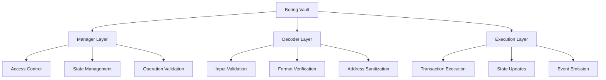
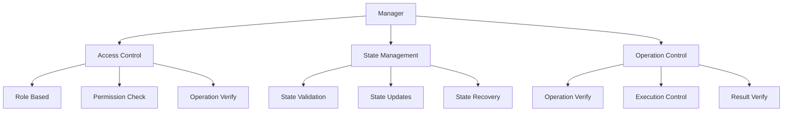
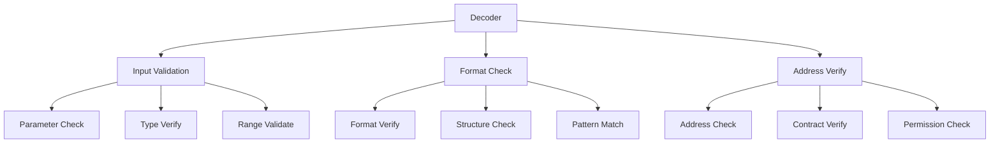
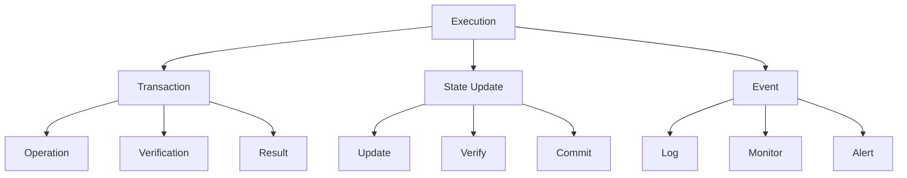
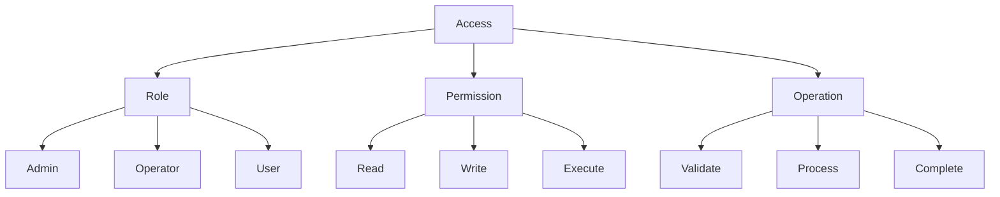
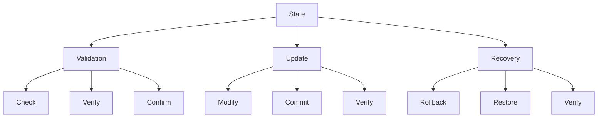
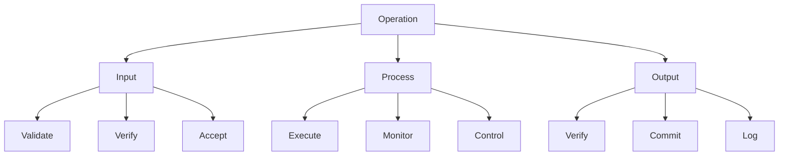

# Boring Vault Security Architecture

## Overview

Boring Vault implements a multi-layered security architecture designed to protect assets and ensure safe protocol operations. This document outlines the security model, its components, and their interactions.

## Security Architecture

## Core Security Components

### 1. Manager Layer

**Security Functions**:
- Access control enforcement
- State management
- Operation validation
- Security policy enforcement

**Limitations**:
- Single point of control
- State management complexity
- Operation validation overhead

### 2. Decoder Layer

**Security Functions**:
- Input validation
- Format verification
- Address sanitization
- Parameter validation

**Limitations**:
- Pure/view function constraints
- Limited state access
- Format-specific validation

### 3. Execution Layer

**Security Functions**:
- Transaction execution
- State updates
- Event emission
- Result verification

**Limitations**:
- Atomic operation constraints
- State update complexity
- Event monitoring overhead

## Security Boundaries

### 1. Access Control

**Boundaries**:
- Role-based access
- Permission levels
- Operation restrictions

**Dangers**:
- Role escalation
- Permission bypass
- Operation abuse

### 2. State Management

**Boundaries**:
- State validation
- Update control
- Recovery mechanisms

**Dangers**:
- State corruption
- Update failure
- Recovery issues

### 3. Operation Control

**Boundaries**:
- Operation validation
- Process control
- Result verification

**Dangers**:
- Operation failure
- Process manipulation
- Result corruption

## Security Limitations

### 1. Architectural Limitations

1. **Layer Dependencies**
   - Inter-layer communication
   - State synchronization
   - Operation coordination

2. **State Management**
   - Complex state transitions
   - Update verification
   - Recovery procedures

3. **Operation Control**
   - Execution constraints
   - Process monitoring
   - Result verification

### 2. Operational Limitations

1. **Access Control**
   - Role management
   - Permission updates
   - Operation restrictions

2. **State Updates**
   - Atomic operations
   - State verification
   - Update commitment

3. **Event Monitoring**
   - Event tracking
   - State logging
   - Alert generation

## Security Dangers

### 1. System Dangers

1. **State Corruption**
   - Invalid state transitions
   - Update failures
   - Recovery issues

2. **Operation Failure**
   - Execution errors
   - Process manipulation
   - Result corruption

3. **Access Compromise**
   - Role escalation
   - Permission bypass
   - Operation abuse

### 2. External Dangers

1. **Network Issues**
   - Transaction failures
   - State inconsistencies
   - Operation delays

2. **Protocol Risks**
   - Integration issues
   - Compatibility problems
   - Update conflicts

3. **User Risks**
   - Operation errors
   - State confusion
   - Access issues

## Security Recommendations

### 1. System Improvements

1. **Access Control**
   - Enhanced role management
   - Permission verification
   - Operation validation

2. **State Management**
   - Improved validation
   - Update verification
   - Recovery procedures

3. **Operation Control**
   - Execution monitoring
   - Process verification
   - Result validation

### 2. Monitoring Enhancements

1. **State Monitoring**
   - State tracking
   - Update logging
   - Recovery alerts

2. **Operation Monitoring**
   - Execution tracking
   - Process logging
   - Result alerts

3. **Access Monitoring**
   - Role tracking
   - Permission logging
   - Operation alerts

## Conclusion

The Boring Vault security architecture provides a robust framework for asset protection and safe protocol operations. While the system has inherent limitations and potential dangers, the multi-layered security model effectively mitigates risks through:

1. **Comprehensive Validation**
   - Input verification
   - State validation
   - Operation control

2. **Access Management**
   - Role-based access
   - Permission control
   - Operation restrictions

3. **State Protection**
   - State validation
   - Update control
   - Recovery mechanisms

The architecture's strength lies in its layered approach to security, with each layer providing specific protections while working together to maintain overall system security. 
