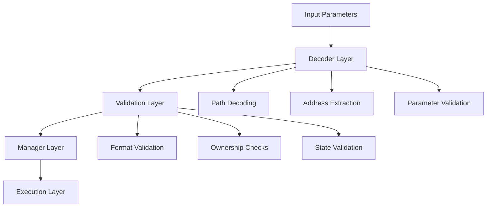
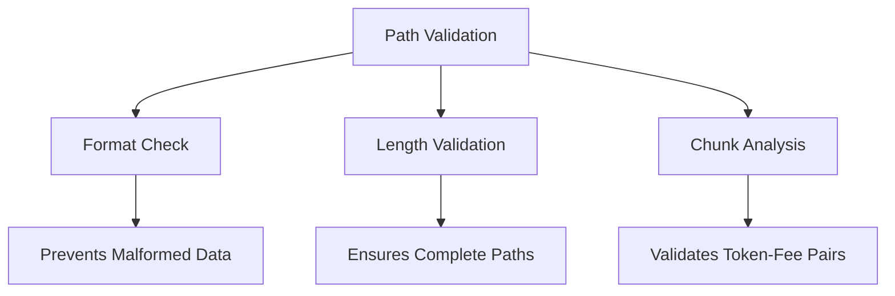
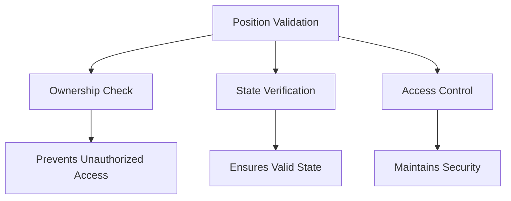
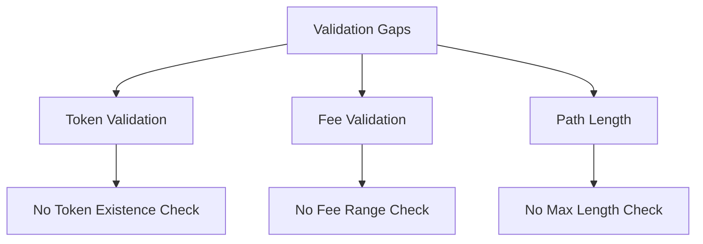
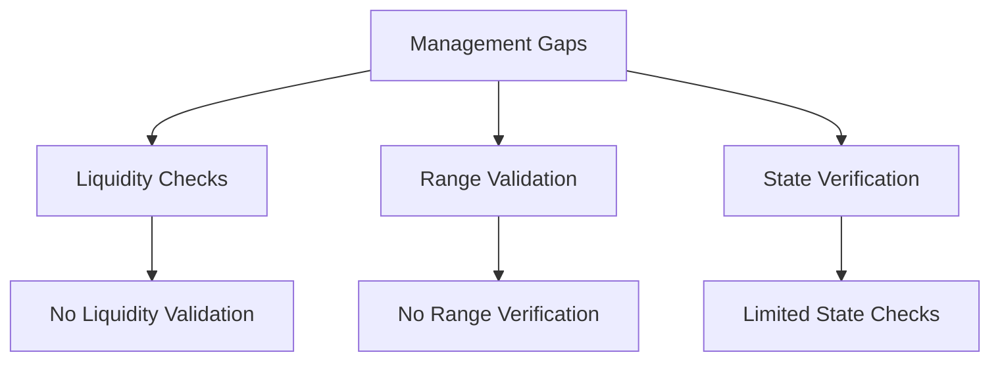
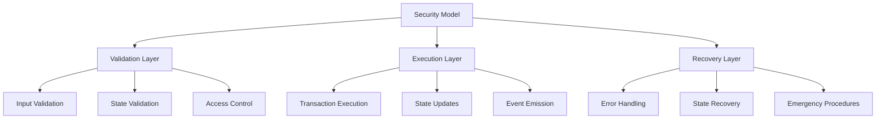

# UniswapV3DecoderAndSanitizer Security Analysis

## Overview

The UniswapV3DecoderAndSanitizer implements a critical validation layer for Uniswap V3 operations in the Boring Vault system. This analysis focuses on its validation design, strengths, and potential weaknesses.

## System Architecture



## Validation Design Analysis

### 1. Path Validation Mechanism

```solidity
function exactInput(DecoderCustomTypes.ExactInputParams calldata params) {
    uint256 chunkSize = 23; // 3 bytes fee + 20 bytes address
    uint256 pathLength = params.path.length;
    if (pathLength % chunkSize != 20) revert UniswapV3DecoderAndSanitizer__BadPathFormat();
}
```

#### Strengths:


1. **Format Enforcement**
   - Strict chunk size validation (23 bytes)
   - Prevents malformed path data
   - Ensures proper token-fee pairing

2. **Length Validation**
   - Validates complete paths
   - Prevents partial path execution
   - Ensures proper token sequence

3. **Chunk Analysis**
   - Validates token-fee pairs
   - Ensures proper path structure
   - Prevents invalid combinations

### 2. Position Management Validation

```solidity
function increaseLiquidity(DecoderCustomTypes.IncreaseLiquidityParams calldata params) {
    if (uniswapV3NonFungiblePositionManager.ownerOf(params.tokenId) != boringVault) {
        revert UniswapV3DecoderAndSanitizer__BadTokenId();
    }
}
```

#### Strengths:


1. **Ownership Verification**
   - Strict token ownership checks
   - Prevents unauthorized access
   - Maintains position security

2. **State Validation**
   - Verifies position existence
   - Ensures valid state
   - Prevents invalid operations

3. **Access Control**
   - Enforces vault ownership
   - Prevents external manipulation
   - Maintains security boundaries

## Potential Weaknesses

### 1. Path Validation Limitations



1. **Token Validation**
   - No token existence verification
   - No token contract validation
   - Potential for invalid token addresses

2. **Fee Validation**
   - No fee range validation
   - No fee tier verification
   - Potential for invalid fee settings

3. **Path Length**
   - No maximum path length check
   - Potential for gas optimization issues
   - Risk of excessive path complexity

### 2. Position Management Gaps



1. **Liquidity Validation**
   - No minimum liquidity check
   - No maximum liquidity validation
   - Potential for inefficient operations

2. **Range Validation**
   - No tick range verification
   - No price range validation
   - Risk of invalid position parameters

3. **State Verification**
   - Limited state checks
   - No position health validation
   - Potential for unhealthy positions

## Security Model Analysis



## Recommendations

### 1. Enhanced Path Validation
```solidity
function validatePath(bytes calldata path) internal view {
    // Add token existence checks
    // Add fee range validation
    // Add maximum path length check
}
```

### 2. Improved Position Management
```solidity
function validatePosition(uint256 tokenId) internal view {
    // Add liquidity range checks
    // Add tick range validation
    // Add position health checks
}
```

### 3. State Verification
```solidity
function verifyState(address token, uint256 amount) internal view {
    // Add token balance checks
    // Add allowance validation
    // Add state consistency checks
}
```

## Conclusion

The UniswapV3DecoderAndSanitizer implements a robust validation layer with several key strengths:

1. **Strong Format Validation**
   - Strict path format enforcement
   - Proper chunk size validation
   - Complete path verification

2. **Secure Position Management**
   - Strict ownership checks
   - State validation
   - Access control enforcement

However, there are areas for improvement:

1. **Enhanced Token Validation**
   - Add token existence checks
   - Implement fee range validation
   - Add maximum path length checks

2. **Improved Position Management**
   - Add liquidity range validation
   - Implement tick range checks
   - Add position health verification

3. **State Verification**
   - Add comprehensive state checks
   - Implement balance validation
   - Add consistency verification

The current design provides a solid foundation but could benefit from additional validation layers to enhance security and reliability. 
